# AI-Driven SDN for IoT — Explained Simply
### What we're building, why we're building it, and how it all works

---

## Table of Contents

1. [The Problem — Why Normal Networks Fail for IoT](#1-the-problem--why-normal-networks-fail-for-iot)
2. [The Big Idea — What is SDN?](#2-the-big-idea--what-is-sdn)
3. [Where AI Comes In](#3-where-ai-comes-in)
4. [The Full System — All Pieces Together](#4-the-full-system--all-pieces-together)
5. [The Hardware — What Physical Things We Use](#5-the-hardware--what-physical-things-we-use)
6. [The Software Stack — What Programs Run Where](#6-the-software-stack--what-programs-run-where)
7. [The Network Topology — How Devices Are Connected](#7-the-network-topology--how-devices-are-connected)
8. [Traffic Types — What Kind of Data Flows](#8-traffic-types--what-kind-of-data-flows)
9. [The Three Routing Policies — Old vs New](#9-the-three-routing-policies--old-vs-new)
10. [How the AI Learns — Deep Q-Network Explained](#10-how-the-ai-learns--deep-q-network-explained)
11. [How a Packet Travels Through the System](#11-how-a-packet-travels-through-the-system)
12. [The OpenFlow Protocol — How Controller Talks to Switch](#12-the-openflow-protocol--how-controller-talks-to-switch)
13. [Training the AI — The Learning Loop](#13-training-the-ai--the-learning-loop)
14. [The Monitoring Dashboard](#14-the-monitoring-dashboard)
15. [The Experiments — How We Prove It Works](#15-the-experiments--how-we-prove-it-works)
16. [The Final Demo — What the Audience Sees](#16-the-final-demo--what-the-audience-sees)
17. [How Everything Connects — The Big Picture](#17-how-everything-connects--the-big-picture)

---

## 1. The Problem — Why Normal Networks Fail for IoT

Imagine a hospital. It has hundreds of devices on the same network:

- A tiny temperature sensor that sends one small message every 5 seconds
- A security camera streaming HD video 24/7
- A device downloading a large firmware update in the background
- An emergency alert system that must reach the server **instantly**

All of these devices share the same network roads — the cables and routers.

**Traditional routers are dumb.** They only know one thing: *what is the shortest path to the destination?* They send everything down the same road. They don't care what the data is, how urgent it is, or how busy the road already is.

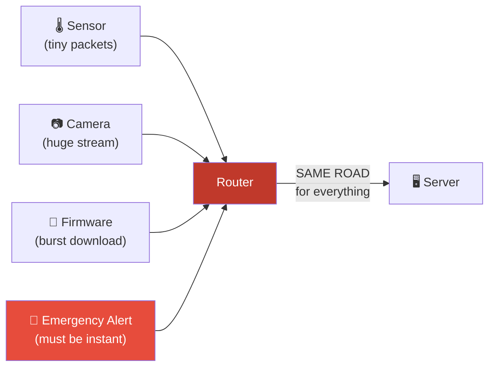

**What goes wrong:**

| Situation                | What Happens                  | Consequence                |
| ------------------------ | ----------------------------- | -------------------------- |
| Camera starts streaming  | Road gets 80% congested       | Everything slows down      |
| Firmware download starts | Road is completely jammed     | Emergency alert is delayed |
| Two cameras at once      | Packets start getting dropped | Sensor data is lost        |

The router keeps sending everything through the same bottleneck path. It has no idea the emergency alert is critical. It has no idea the firmware update can wait. This is the core problem.

---

## 2. The Big Idea — What is SDN?

**SDN stands for Software Defined Networking.**

The key insight is: *separate the brain from the body.*

In a normal network, every switch/router has its own brain. Each one independently decides where to send packets. They can't coordinate. They can't adapt together.

In SDN, all the switches become "mindless forwarders." They just follow rules. One single **central controller** — the brain — tells all switches what to do.

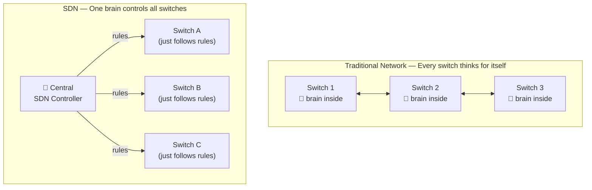

**Why is this powerful?**

Because now the central controller can:
- See the **entire network** at once
- Know how busy every link is
- Install different rules for different types of traffic
- Change routing decisions in real time
- Be upgraded with new logic — like AI — without touching any switch

The switches themselves are just dumb boxes running **Open vSwitch** — a software switch that accepts instructions via the **OpenFlow protocol** (think of it like a remote control language).

---

## 3. Where AI Comes In

The SDN controller is the brain. But what should the brain's strategy be?

Even with full network visibility, deciding the optimal path for every flow — considering traffic type, link congestion, queue lengths, and delay — is too complex to hardcode with rules.

This is where **Reinforcement Learning AI** comes in.

Think of it like training a dog:
- The dog (AI) takes an action (chooses a path)
- It gets a treat (reward) if the flow completed fast with no packet loss
- It gets scolded (negative reward) if the flow was slow or dropped packets
- Over thousands of repetitions, the dog learns which actions lead to treats

Our AI model is called a **Deep Q-Network (DQN)**. It watches the network, picks a path, and learns from the result — getting smarter over time.

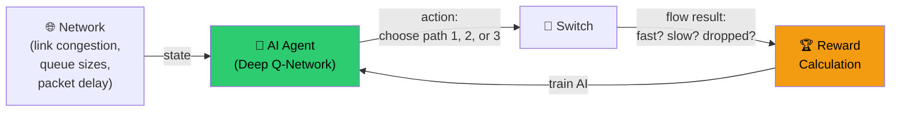

---

## 4. The Full System — All Pieces Together

Here is every component of the project and how they connect:

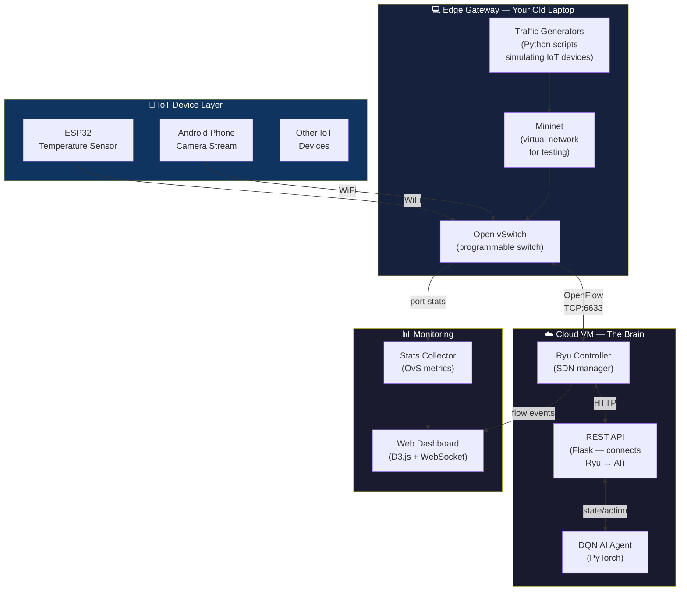

---

## 5. The Hardware — What Physical Things We Use

We need surprisingly little hardware. Here's what each piece does:

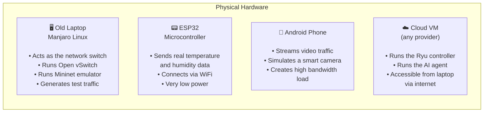

**Why use Mininet on the laptop instead of real switches?**

Real network switches cost thousands of dollars. Mininet lets you simulate an entire network — multiple switches, hosts, links with specific speeds and delays — all on one laptop. For testing and research, this is perfect. You can test 10 different topologies in an afternoon.

---

## 6. The Software Stack — What Programs Run Where

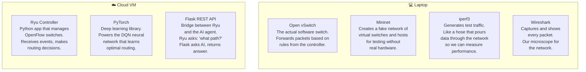

---

## 7. The Network Topology — How Devices Are Connected

We build this virtual network inside Mininet:

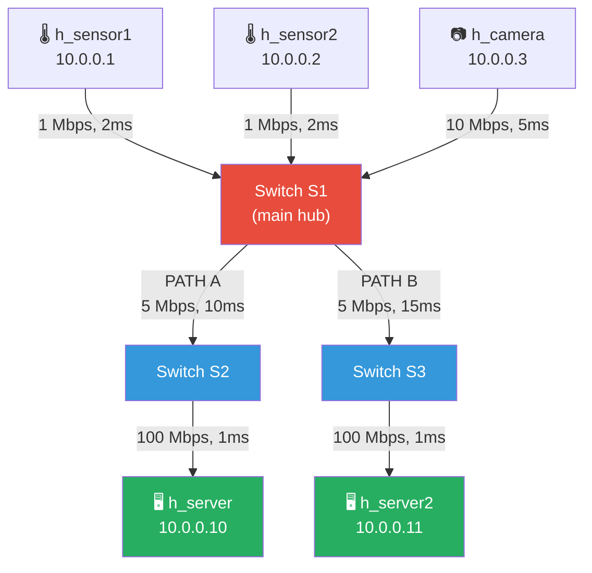

**Key design choices:**

- **Two paths from S1 to servers** — This gives the AI a choice. Without two paths, there's nothing to optimize.
- **Path A vs Path B** — Both have 5 Mbps bandwidth, but Path B has 5ms more delay. AI learns when to use each.
- **Different link speeds for IoT devices** — Sensors get 1 Mbps (realistic for ESP32 WiFi), camera gets 10 Mbps (realistic for video).
- **Fast server connections** — 100 Mbps, because servers shouldn't be the bottleneck in our experiment.

---

## 8. Traffic Types — What Kind of Data Flows

We simulate three very different types of IoT traffic. Each one stresses the network differently.

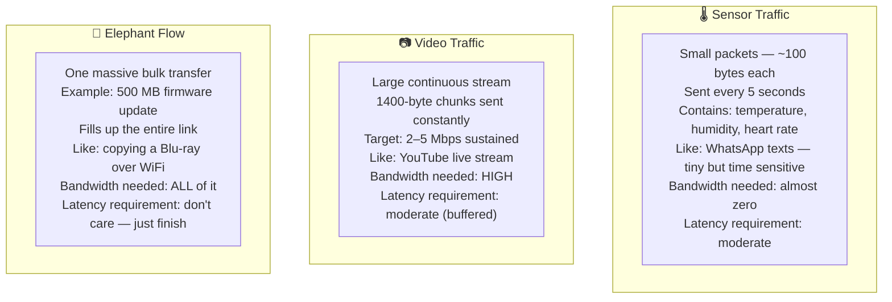

**Why these three matter:**

The elephant flow is the villain. When it starts, it tries to consume the entire 5 Mbps path. A dumb router keeps sending the sensor and video traffic down the same congested road. Our AI controller should detect this and shift the sensor/video to Path B — keeping their performance intact while the elephant uses Path A.

---

## 9. The Three Routing Policies — Old vs New

We implement and compare three different strategies for deciding which path to use.

### Policy 1: Shortest Path Routing

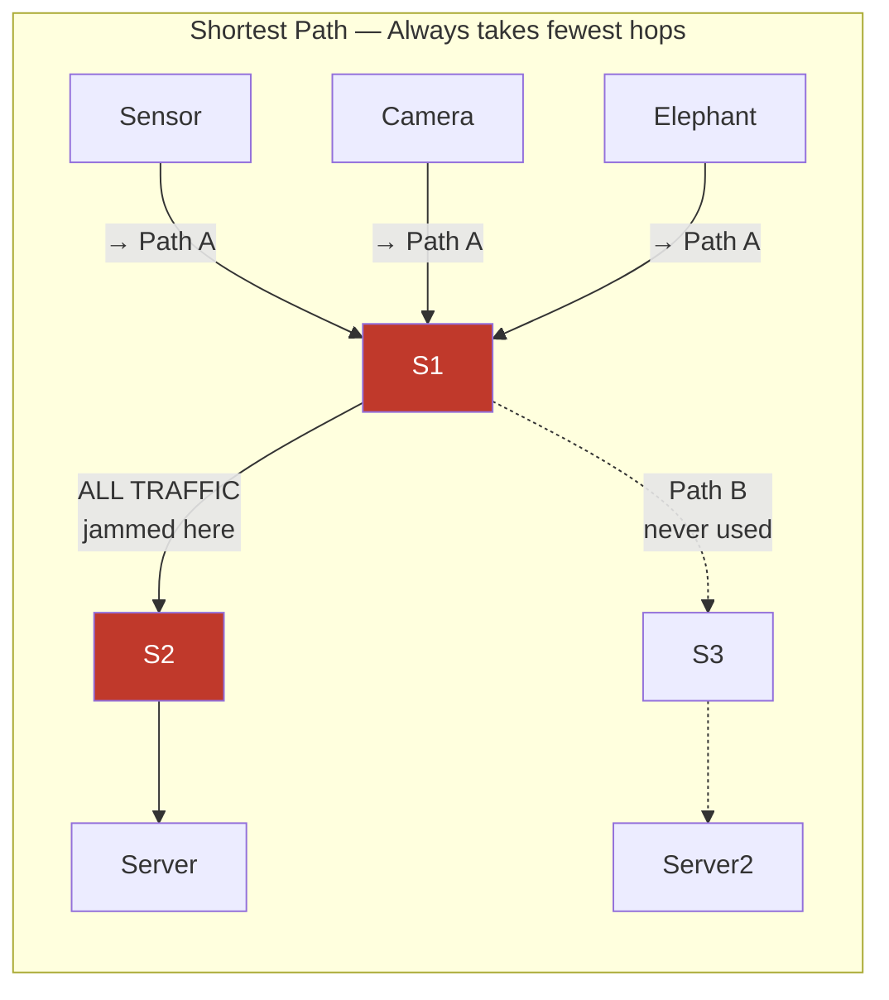

Everything goes the same way. Path B sits empty. Path A becomes a traffic jam. Simple to implement, poor performance under load.

---

### Policy 2: ECMP (Equal Cost Multipath)

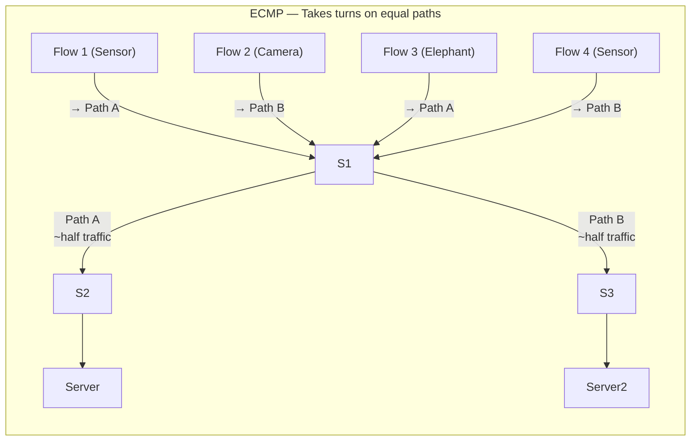

Better than Shortest Path — at least both paths are used. But it's still blind. It might put the huge Elephant Flow and a critical sensor on the same path just because it's "that flow's turn."

---

### Policy 3: AI (DQN) Routing

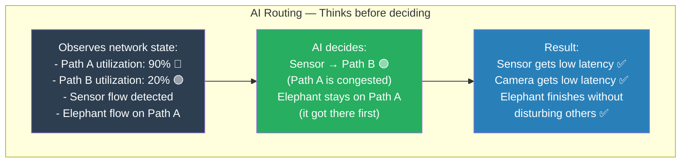

The AI doesn't follow a fixed rule. It looks at what's actually happening right now and picks the best path for each flow type. This is the key advantage.

---

## 10. How the AI Learns — Deep Q-Network Explained

Don't be scared by "Deep Q-Network." Here's what it actually means, step by step.

### What is Q-Learning?

Q stands for "Quality." We want to know: *"How good is this action in this situation?"*

We build a table:

| Situation (State) | Take Path A | Take Path B |
|---|---|---|
| Path A: 10% busy, Path B: 10% busy | Q = 8.5 | Q = 8.2 |
| Path A: 90% busy, Path B: 20% busy | Q = 1.2 | Q = 9.1 |
| Path A: 50% busy, Path B: 50% busy | Q = 5.0 | Q = 4.9 |

The AI always picks the action with the **highest Q value** in the current situation.

### Why "Deep"?

The state of our network has 8 numbers (link utilizations, queue lengths, delay, flow type). There are infinite possible combinations. We can't store a table big enough.

So instead of a table, we use a **neural network** to estimate Q values. That's the "Deep" part — a neural network is layers of math that can approximate any function.

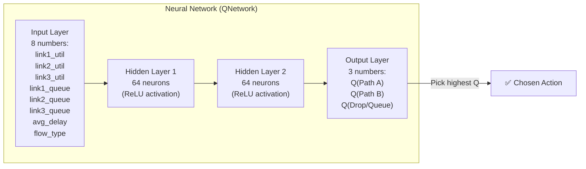

### The Learning Loop

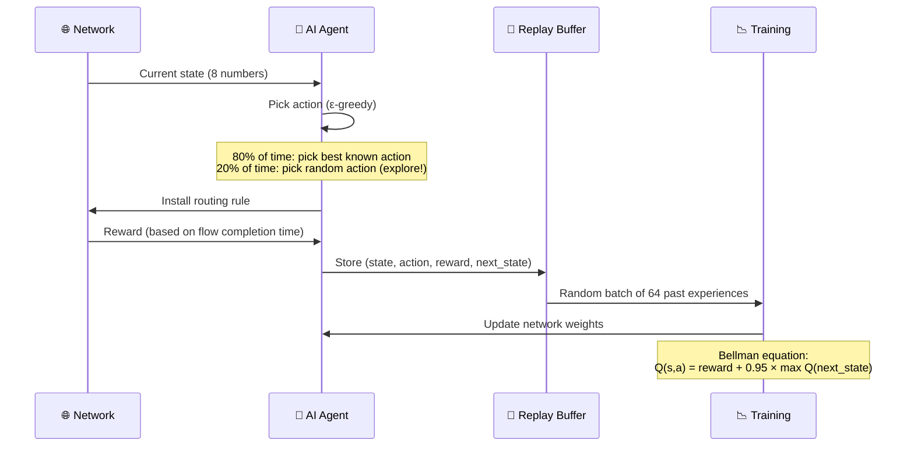

**Why store past experiences and train randomly?**

If we trained on every experience in order, the AI would only remember the most recent situation. By storing thousands of past experiences and sampling randomly, it learns from a diverse mix — like studying flashcards rather than just reading the last chapter.

### Exploration vs Exploitation (ε-greedy)

This is a fundamental challenge: should the AI try new things or stick to what it knows works?

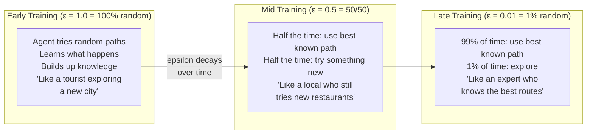

---

## 11. How a Packet Travels Through the System

Let's follow a single emergency sensor reading from an ESP32 to the server.

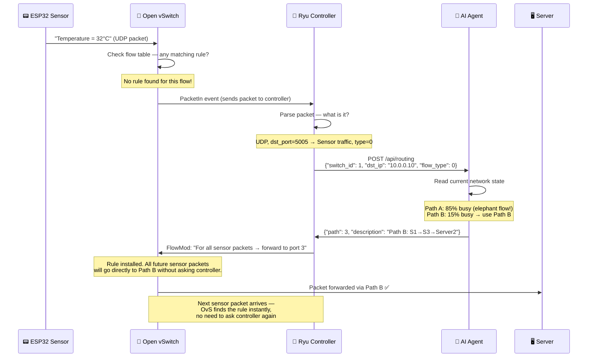

**The key insight:** The controller is only consulted for the **first packet** of each flow. After that, the switch handles it directly using the installed rule. This makes it fast — no controller bottleneck for every packet.

---

## 12. The OpenFlow Protocol — How Controller Talks to Switch

OpenFlow is the language the controller uses to program switches. Think of it like a waiter taking orders from the chef (controller) and delivering them to the kitchen (switch).

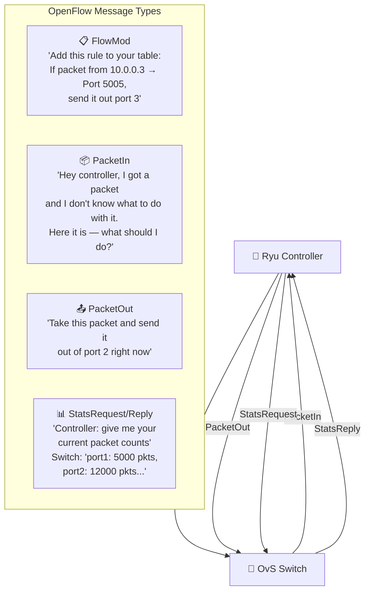

**What is a Flow Table?**

Every OvS switch keeps a table of rules. Each rule says: "If a packet matches these conditions, do this action."

```
╔══════════════════════════════════════════════════════════════╗
║                    Flow Table (inside S1)                    ║
╠════════════════════╦═══════════════╦════════════════════════╣
║ Match              ║ Action        ║ Stats                  ║
╠════════════════════╬═══════════════╬════════════════════════╣
║ dst_ip=10.0.0.10   ║ → Port 2      ║ 1,200 packets, 120KB   ║
║ udp dst_port=5005  ║ (Path A)      ║                        ║
╠════════════════════╬═══════════════╬════════════════════════╣
║ dst_ip=10.0.0.11   ║ → Port 3      ║ 850 packets, 18MB      ║
║ tcp dst_port=5007  ║ (Path B)      ║                        ║
╠════════════════════╬═══════════════╬════════════════════════╣
║ (anything else)    ║ → Controller  ║ 42 packets             ║
║                    ║ (table-miss)  ║                        ║
╚════════════════════╩═══════════════╩════════════════════════╝
```

---

## 13. Training the AI — The Learning Loop

Before the demo, we need to train the AI. Here's the full loop:

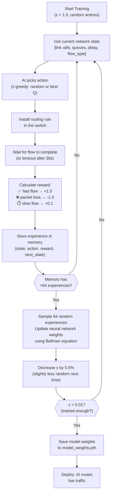

**How long does training take?**

In a Mininet simulation, one "episode" (one flow from start to finish) takes about 2–5 seconds. With ~2000 episodes needed, that's roughly **2–3 hours of training**. We run this overnight and load the saved weights for the demo.

---

## 14. The Monitoring Dashboard

While everything runs, we have a live web dashboard showing exactly what's happening.

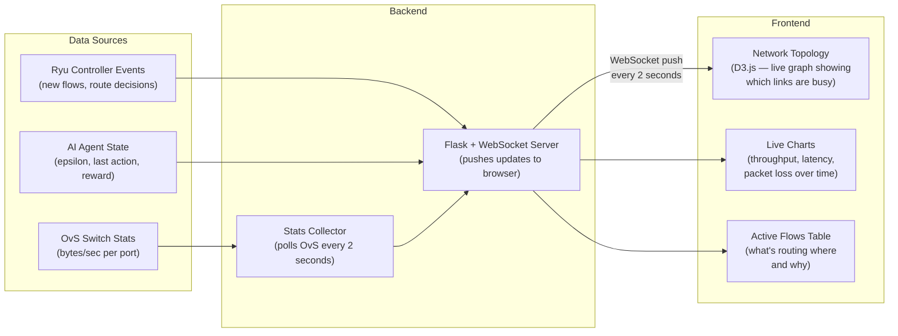

**What the dashboard shows:**

- 🔴 Red links = congested (>70% utilization)
- 🟡 Yellow links = moderate (30–70%)
- 🟢 Green links = free (<30%)
- Arrows showing which path each active flow is using
- Real-time latency graph for the sensor data
- AI epsilon value (showing training progress)

---

## 15. The Experiments — How We Prove It Works

We run 9 experiments: 3 routing policies × 3 traffic scenarios.

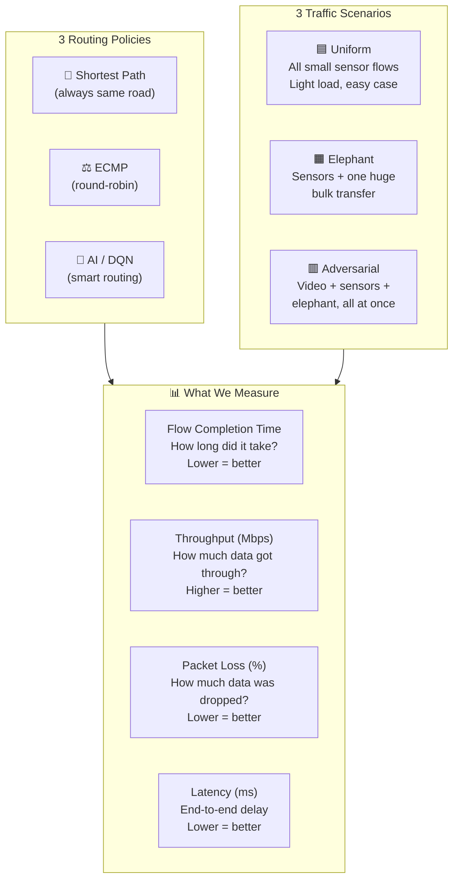

**Expected results — what we expect to see:**

```mermaid
xychart-beta
    title "Expected: Avg Flow Completion Time (lower is better)"
    x-axis ["Uniform", "Elephant Flow", "Adversarial"]
    y-axis "Time (seconds)" 0 --> 20
    bar [2, 5, 4]
    bar [2, 4, 3]
    bar [2, 2, 2]
```

*Bar order: Shortest Path (high), ECMP (medium), AI (low)*

The key insight the experiment proves: in easy conditions (uniform traffic), all three policies perform similarly. The AI's advantage only shows clearly under **stress** — when the elephant flow appears and the adversarial scenario creates real congestion. That's when dumb routing breaks down and smart routing shines.

---

## 16. The Final Demo — What the Audience Sees

The demo tells a story. Here's the narrative arc:

```mermaid
timeline
    title Demo Story Arc

    section Phase 1 — Calm
        Sensors running : Small packets flowing every 5 seconds
                        : Latency is low (< 5ms)
                        : All policies perform well
                        : "Everything looks fine"

    section Phase 2 — Stress
        Video stream added : 3 Mbps continuous flow starts
                           : Network starts to fill up
                           : Shortest path latency creeps up
                           : AI notices, prepares to reroute

    section Phase 3 — Crisis
        Elephant flow injected : 500MB bulk download starts
                               : Path A → CONGESTED 🔴
                               : Shortest path : sensor latency spikes to 200ms
                               : ECMP : moderate degradation
                               : AI : shifts sensors to Path B, latency stays < 10ms ✅

    section Phase 4 — Recovery
        Elephant flow ends : Congestion clears
                           : AI gradually migrates flows back to Path A
                           : Network stabilises
```

**The live demonstration steps:**

1. Open dashboard in browser — show the live network topology
2. Start sensor traffic — show green links, low latency chart
3. Start video stream — show one link turn yellow
4. Switch routing mode to "Shortest Path" — inject elephant flow — watch the dashboard turn red, latency chart spike
5. Switch routing mode to "AI" — inject elephant flow again — watch AI move flows to Path B, latency stays flat
6. Point out the AI epsilon on screen — show it's not randomly exploring, it's using learned knowledge

---

## 17. How Everything Connects — The Big Picture

Here is the complete flow of the entire system from start to finish, all on one diagram:

```mermaid
flowchart TB
    subgraph Physical["🌍 Physical World"]
        ESP["ESP32\nsends real sensor data"]
    end

    subgraph Laptop["💻 Laptop — Edge"]
        MN_Host["Mininet Virtual Host\n(simulates more IoT devices)"]
        OvS_SW["Open vSwitch\n(forwards packets)\nHolds flow table rules"]
    end

    subgraph CloudVM["☁️ Cloud VM — Intelligence"]
        RyuCtrl["Ryu Controller\n• Manages switch connections\n• Handles PacketIn events\n• Installs FlowMod rules"]
        FlaskAPI["Flask REST API\n• Bridge between Ryu & AI\n• Exposes /api/routing endpoint"]
        DQNModel["DQN AI Agent\n• Neural network (PyTorch)\n• Reads network state\n• Outputs best path action\n• Learns from rewards"]
        StatsDB["Statistics Store\n• Link utilizations\n• Queue lengths\n• Packet delays"]
    end

    subgraph Browser["🌐 Browser — Visibility"]
        Dash["Live Dashboard\n• Network topology map\n• Real-time charts\n• Routing decisions log"]
    end

    ESP -->|"UDP packets\nover WiFi"| OvS_SW
    MN_Host -->|"virtual packets"| OvS_SW

    OvS_SW -->|"PacketIn\n(unknown flow)"| RyuCtrl
    RyuCtrl -->|"FlowMod\n(install rule)"| OvS_SW
    OvS_SW -->|"port statistics\nevery 2s"| StatsDB

    RyuCtrl -->|"ask: what path?\nPOST /api/routing"| FlaskAPI
    FlaskAPI -->|"get state\ncall select_action"| DQNModel
    DQNModel -->|"action: path 1/2/3"| FlaskAPI
    FlaskAPI -->|"return port number"| RyuCtrl

    RyuCtrl -->|"submit reward\nafter flow ends"| FlaskAPI
    FlaskAPI -->|"store experience\ncall train()"| DQNModel

    StatsDB -->|"state vector\n[utils, queues, delay]"| DQNModel
    StatsDB -->|"WebSocket push"| Dash
    RyuCtrl -->|"flow events"| Dash

    style Physical fill:#1a1a2e,color:#eee
    style Laptop fill:#16213e,color:#eee
    style CloudVM fill:#0f3460,color:#eee
    style Browser fill:#1b2631,color:#eee
```

### Summary — What Each Component Owns

| Component | Lives On | Does What |
|---|---|---|
| ESP32 / IoT Device | Physical hardware | Generates real traffic |
| Mininet | Laptop | Simulates extra IoT devices and network |
| Open vSwitch | Laptop | Acts as the programmable network switch |
| Ryu Controller | Cloud VM | Manages switches, handles new flows |
| Flask REST API | Cloud VM | Connects controller to AI agent |
| DQN AI Agent | Cloud VM | Decides which path to use, learns over time |
| Stats Collector | Laptop/VM | Measures link utilization, delay, queues |
| Dashboard | Cloud VM (browser) | Shows everything in real time |

### The Three Questions — Answered Simply

**Q: What is the system doing?**
Routing IoT network traffic intelligently — sending different types of traffic down different network paths based on live conditions, not just shortest distance.

**Q: How does it do it?**
An AI agent watches the network state, picks the best path for each flow, installs that as a rule in the switch, and learns from whether that was a good or bad choice.

**Q: Why is it better?**
Because it adapts. When an elephant flow congests one path, the AI detects this and moves critical traffic to the other path — something no static routing algorithm can do.

---

*"The goal isn't just to build a network that works. It's to build one that thinks."*

---

*Simple Explainer v1.0 — AI-Driven SDN for IoT*
