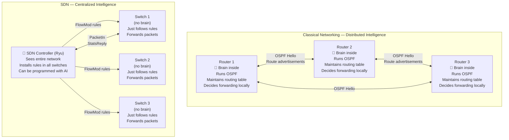

# Classical Networking vs SDN
### A Deep, Relevant Comparison for the AI-Driven IoT Routing Project

---

## Table of Contents

- [[#1. Why This Comparison Matters|1. Why This Comparison Matters]]
- [[#2. The Core Architectural Difference|2. The Core Architectural Difference]]
- [[#3. How Routing Decisions Are Made|3. How Routing Decisions Are Made]]
- [[#4. The Control Plane and Data Plane|4. The Control Plane and Data Plane]]
- [[#5. Flow Tables vs Routing Tables|5. Flow Tables vs Routing Tables]]
- [[#6. Traffic Awareness and QoS|6. Traffic Awareness and QoS]]
- [[#7. Failure Handling|7. Failure Handling]]
- [[#8. Programmability and AI Integration|8. Programmability and AI Integration]]
- [[#9. Side-by-Side Feature Comparison|9. Side-by-Side Feature Comparison]]
- [[#10. Why Our Project Chose SDN|10. Why Our Project Chose SDN]]
- [[#11. Interconnections|11. Interconnections]]

---

## 1. Why This Comparison Matters

Before understanding what makes our AI-SDN system special, you need to understand **what it replaced** — and why that replacement was necessary.

Classical Networking (CN) is the foundation of the internet as we know it. Every home router, every enterprise switch, every ISP backbone runs classical networking protocols. It works. It scales. But it has a fundamental limitation: **the intelligence is locked inside the devices**.

Our project exists precisely because classical networking cannot do what we need:
- It cannot automatically reroute a sensor flow away from a congested link
- It cannot learn that elephant flows appear every morning and pre-empt them
- It cannot treat an emergency cardiac monitor differently from a firmware update
- It cannot run a neural network inside a Cisco router

SDN removes these limitations by separating the network's brain from its body. This comparison will show you exactly how — at every layer that is relevant to our project.

---

## 2. The Core Architectural Difference

This is the single most important conceptual difference. Everything else follows from this.



In CN: every router is autonomous, self-contained, and peers with its neighbors via routing protocols to build a shared view of the network.

In SDN: all switches are headless. One centralized program — the [[SDN_Controller|SDN Controller]] — has complete control. It sees the whole network and can program every switch in milliseconds.

For a deeper dive into this specific split, see [[Centralized_vs_Distributed_Control]].

---

## 3. How Routing Decisions Are Made

### Classical Networking

In CN, routing happens in two phases that run continuously and independently on every device:

**Phase 1 — Control Plane (protocol-driven):**
Each router runs a routing protocol like [[Routing_Protocols_CN|OSPF or BGP]], which:
1. Discovers neighbors (via Hello packets)
2. Advertises its known networks
3. Receives advertisements from neighbors
4. Runs a path computation algorithm (Dijkstra for OSPF, path-vector for BGP)
5. Builds a **routing table** (RIB — Routing Information Base)

**Phase 2 — Data Plane (hardware-driven):**
When a packet arrives, the router looks up the destination IP in its routing table and forwards the packet out the correct interface. This lookup happens in hardware at line rate.

```
Classical Router receiving a packet:
    IP Destination = 10.0.0.10
    Lookup routing table:
        10.0.0.0/24  →  via 192.168.1.1  (interface eth1)
    Forward out eth1
    (No knowledge of: congestion, traffic type, priority, history)
```

**Critical limitation:** The routing table only knows *destinations*, not *conditions*. Whether eth1 is 5% utilized or 95% utilized, the packet goes the same way.

### Software Defined Networking

In SDN, routing decisions are made centrally, on-demand, and with full network visibility:

1. First packet of a new flow arrives at a switch → no matching rule → [[OpenFlow_Protocol|PacketIn]] sent to controller
2. Controller (our Ryu app) receives the packet, inspects its headers
3. Controller classifies the flow type (sensor/video/elephant)
4. Controller queries the [[DQN_Model|DQN AI agent]] with the current 20-feature network state
5. AI returns the optimal path
6. Controller installs a [[Flow_Tables_SDN|FlowMod rule]] in the switch
7. All future packets of that flow are forwarded at hardware speed by the switch

```
SDN Controller receiving PacketIn:
    IP: 10.0.0.3 → 10.0.0.10, UDP:5006 (video flow)
    Network state: Path A = 88% utilized, Path B = 20% utilized
    AI decision: Q(PathA)=0.12, Q(PathB)=1.08 → use Path B
    Install: match(ip_dst=10.0.0.10, udp_dst=5006) → output port 3
    (Full knowledge of: congestion, traffic type, priority, 20s of history)
```

---

## 4. The Control Plane and Data Plane

This is the foundational concept behind the entire SDN vs CN comparison.

> For a complete deep-dive, see [[Control_Plane_vs_Data_Plane]].

**The short version:**

| | Classical Networking | SDN |
|---|---|---|
| **Control Plane** | Inside every router/switch | Centralized in the SDN controller |
| **Data Plane** | Inside every router/switch | Inside every switch (unchanged) |
| **Separation** | No — tightly coupled in the same device | Yes — completely separated |
| **Protocol** | OSPF/BGP/RIP between devices | OpenFlow between controller and switches |
| **Update speed** | Seconds to minutes (convergence time) | Milliseconds (direct FlowMod installation) |

In CN, the control plane and data plane live together in the same device. When OSPF converges on a new route, it updates the routing table inside the same box that also forwards packets.

In SDN, the control plane lives in the controller (a separate machine). The data plane lives in the switches. They communicate via the [[OpenFlow_Protocol|OpenFlow protocol]]. This separation is what makes SDN programmable — you can upgrade the controller's intelligence without touching the switches.

---

## 5. Flow Tables vs Routing Tables

This is where SDN gets fundamentally more powerful than CN for our use case.

> For a complete deep-dive, see [[Flow_Tables_SDN]].

### Classical Routing Table

```
Destination        Next Hop          Interface    Metric
10.0.0.0/24        192.168.1.1       eth1         10
0.0.0.0/0          192.168.0.1       eth0         1     (default)
```

A routing table matches only the **destination IP address**. It cannot match on source IP, port number, protocol, or any other field. Every packet to the same destination takes the same path, always.

**Consequence for our project:** A 500 MB firmware update (elephant flow) and a 100-byte temperature sensor reading going to the same server will always take the same path. There is no mechanism to separate them.

### SDN Flow Table

```
╔══════════════════════════════╦═══════════════════╦═══════════════╗
║ Match Fields                 ║ Actions           ║ Priority      ║
╠══════════════════════════════╬═══════════════════╬═══════════════╣
║ ip_dst=10.0.0.10            ║ output(port=3)    ║ 10            ║
║ udp_dst=5006 (video)         ║ (Path B)          ║               ║
╠══════════════════════════════╬═══════════════════╬═══════════════╣
║ ip_dst=10.0.0.11            ║ output(port=2)    ║ 10            ║
║ tcp_dst=5007 (elephant)      ║ (Path A)          ║               ║
╠══════════════════════════════╬═══════════════════╬═══════════════╣
║ ip_dst=10.0.0.10            ║ output(port=2)    ║ 5             ║
║ udp_dst=5005 (sensor)        ║ (Path A)          ║               ║
╠══════════════════════════════╬═══════════════════╬═══════════════╣
║ (table-miss)                 ║ → Controller      ║ 0             ║
╚══════════════════════════════╩═══════════════════╩═══════════════╝
```

A flow table can match on **any combination** of header fields: source IP, destination IP, source port, destination port, protocol, VLAN, DSCP flags, input port — up to 12 fields simultaneously in OpenFlow 1.3.

**Consequence for our project:** The sensor flow to 10.0.0.10 on UDP:5005 and the elephant flow to 10.0.0.11 on TCP:5007 can be given entirely different forwarding rules, even though they're going to the same subnet. The AI can differentiate — CN fundamentally cannot.

---

## 6. Traffic Awareness and QoS

### Classical Networking QoS

CN does have mechanisms for Quality of Service — but they are static and per-device:

- **DSCP/DiffServ:** Packets are marked with a QoS class at the source. Every router must be individually configured to honor those markings with specific queue policies (priority queuing, weighted fair queuing).
- **RSVP (Resource Reservation Protocol):** Flows can request bandwidth reservation along a path — but this requires every router along the path to support and enforce it.
- **Traffic shaping/policing:** Each router individually enforces rate limits based on locally configured policies.

**Problems:**
- Every single router must be configured consistently — a manual, error-prone process
- No global view: a router enforcing priority queuing doesn't know whether the link two hops ahead is congested
- Static policies: you configure QoS limits based on expected traffic, not actual conditions
- No machine learning: rules are fixed, hand-crafted by a network engineer

### SDN with AI Routing (Our Project)

In SDN, traffic awareness is a first-class capability:

- The controller collects real-time statistics from all switches every 2 seconds
- The AI agent builds a full network picture: utilizations, queue depths, jitter, flow counts across all paths
- Routing decisions are made dynamically based on current conditions
- Different traffic types receive different treatment automatically — learned from experience, not hardcoded
- No per-device configuration needed: one policy change in the controller propagates to all switches instantly

**Example comparing CN vs SDN QoS under elephant flow:**

| Moment | Classical Networking | Our AI-SDN |
|---|---|---|
| T=0: Elephant flow starts on Path A | Router forwards all traffic down Path A (same route) | AI detects Path A utilization rising (trend feature) |
| T=2s: Path A at 90% utilization | Sensor packets start queuing behind elephant | AI installs FlowMod: sensors → Path B |
| T=5s: Path A at 96%, drops starting | Sensors experience 200ms+ delay, some packets dropped | Sensors on Path B: 18ms delay, 0% loss |
| T=30s: Elephant flow ends | Path A recovers, sensors continue (still suffering a bit) | AI detects Path A clearing, gradually shifts sensors back |

---

## 7. Failure Handling

### Classical Networking Failure Recovery

When a link fails in CN:
1. The connected routers detect the failure (interface goes down)
2. They send OSPF Link State Advertisements (LSAs) to all neighbors: "Link X is down"
3. LSAs flood through the network (TTL-limited)
4. Every router re-runs Dijkstra with the failed link removed
5. Routing tables are updated across the entire network

**Convergence time:** 30 seconds to several minutes in older OSPF implementations. Modern OSPF with fast hello timers: 1–3 seconds. Still — during that window, traffic is blackholed or looping.

### SDN Failure Recovery

When a link fails in SDN:
1. The switch detects the link down event (OpenFlow PortStatus message)
2. The controller receives the PortStatus event instantly
3. The controller re-runs its path computation on the updated topology graph
4. The controller sends FlowMod messages to all affected switches — updating all routing rules
5. All switches are updated

**Convergence time:** Milliseconds to low seconds. No protocol flooding required. The controller already knows the entire topology — it just needs to push new FlowMods.

**For our IoT project:** Sensor data and emergency alerts cannot tolerate 30-second blackholes. SDN's fast failover is a safety-critical advantage.

---

## 8. Programmability and AI Integration

This is the decisive difference for our project.

> For a complete deep-dive, see [[Network_Programmability]].

### Can You Put AI Inside a Classical Router?

No — not in any practical sense.

Classical routers run closed, vendor-specific firmware. You cannot install a PyTorch model on a Cisco IOS router. You cannot write a Python function that gets called for every routing decision. You cannot access the raw packet statistics needed to compute the AI's state vector.

The routing protocols are fixed algorithms (Dijkstra, Bellman-Ford). You can tune parameters (timer values, metric weights) but you cannot replace the algorithm with a neural network.

### AI Integration in SDN

In SDN, the controller is **just a program** — in our case, a Python application (Ryu). You can call any Python library from within it:

```python
# Inside Ryu's packet_in_handler:
import requests
import torch  # or call Flask API

# Query the DQN neural network for a routing decision
response = requests.post(AI_API_URL + "/api/routing", json=state_data)
action = response.json()['action']   # Neural network output, used directly
```

The controller can:
- Import PyTorch and run inference directly
- Call a Flask REST API that wraps the AI agent
- Log all state-action-reward tuples for offline training
- Load and swap model weights without restarting
- Switch between routing policies (Shortest Path / ECMP / AI) at runtime

**This is why SDN was chosen for our project.** Classical networking fundamentally cannot host this kind of intelligence. SDN makes it architecturally straightforward.

---

## 9. Side-by-Side Feature Comparison

| Feature | Classical Networking | SDN (our project) |
|---|---|---|
| **Intelligence location** | Distributed — every device | Centralized — one controller |
| **Routing algorithm** | Fixed (OSPF Dijkstra, BGP) | Pluggable (SP / ECMP / AI DQN) |
| **Match criteria** | Destination IP only | Any header field (12+ fields) |
| **Traffic differentiation** | DSCP markings (manual config) | Per-flow rules based on type, priority, size |
| **Congestion awareness** | None (routing ignores load) | Real-time: utilization, queues, jitter |
| **Failure recovery** | 1–3 seconds (OSPF fast) | Milliseconds (direct FlowMod updates) |
| **AI integration** | Impossible (closed firmware) | Native (controller is open Python code) |
| **Configuration** | Per-device, manual, CLI | Centralized: one program, instant propagation |
| **Global network view** | No (each device sees only its neighbors) | Yes (controller sees full topology) |
| **Rule update speed** | Seconds (protocol convergence) | Milliseconds (FlowMod messages) |
| **IoT traffic awareness** | None | Sensor / Video / Elephant classification |
| **Historical awareness** | None | LSTM: last 20 seconds of network state |
| **Hardware requirement** | Vendor-specific routers | Any OpenFlow-compatible switch (even software) |
| **Multi-vendor support** | Difficult (proprietary protocols) | Yes (OpenFlow is vendor-neutral) |
| **Experimental flexibility** | Very low (can't change algorithms) | Very high (change policy with one variable) |

---

## 10. Why Our Project Chose SDN

The decision to use SDN instead of classical networking was not arbitrary. Each requirement of our project maps directly to a capability that only SDN provides:

| Project Requirement | CN Can Do It? | SDN Can Do It? | How |
|---|---|---|---|
| Route sensor flows differently from elephant flows | ❌ | ✅ | Flow table matches on dst_port |
| React to congestion in real time | ❌ | ✅ | AI reads stats, updates FlowMods in ms |
| Give emergency flows priority routing | ❌ (only static DSCP per-device) | ✅ | `priority_flag` in state → 5× reward multiplier |
| Run a PyTorch neural network in the routing logic | ❌ | ✅ | Ryu calls Flask API → DQN agent |
| Learn from experience (training loop) | ❌ | ✅ | Ryu submits rewards; DQN trains offline |
| Switch between routing policies for live demo | ❌ | ✅ | Single REST call changes `routing_policy` |
| See full network state (all links, all queues) | ❌ | ✅ | Controller polls all switches via StatsRequest |
| Simulate entire network on one laptop (Mininet) | ❌ | ✅ | Mininet emulates OpenFlow switches |

SDN is not just "better" than CN in general. It is **the only architecture** that allows intelligent, learning-based, traffic-aware IoT routing. Classical networking cannot even express the problem our AI is solving.

---

## 11. Interconnections

- [[Control_Plane_vs_Data_Plane]] — the foundational concept behind why CN and SDN differ architecturally
- [[Routing_Protocols_CN]] — how OSPF and BGP work inside classical routers
- [[Flow_Tables_SDN]] — how SDN's flow tables enable per-flow matching that CN routing tables cannot
- [[Centralized_vs_Distributed_Control]] — the architectural tradeoffs of one brain vs many brains
- [[Network_Programmability]] — why SDN can host AI and CN cannot
- [[SDN_Controller]] *(in Knowledge_System/)* — the Ryu controller that is our SDN implementation
- [[OpenFlow_Protocol]] *(in Knowledge_System/)* — the southbound protocol between controller and switches
- [[DQN_Model]] *(in Knowledge_System/)* — the AI that replaces CN's fixed routing algorithms

---

*CN vs SDN Comparison v1.0 — AI-Driven SDN for IoT*
