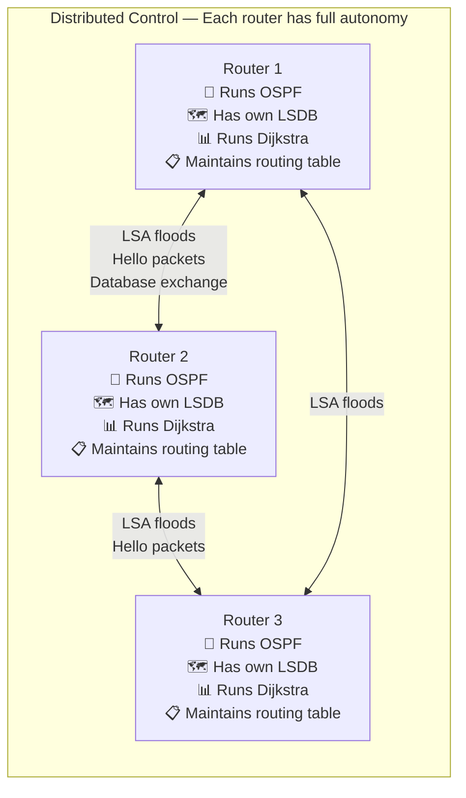
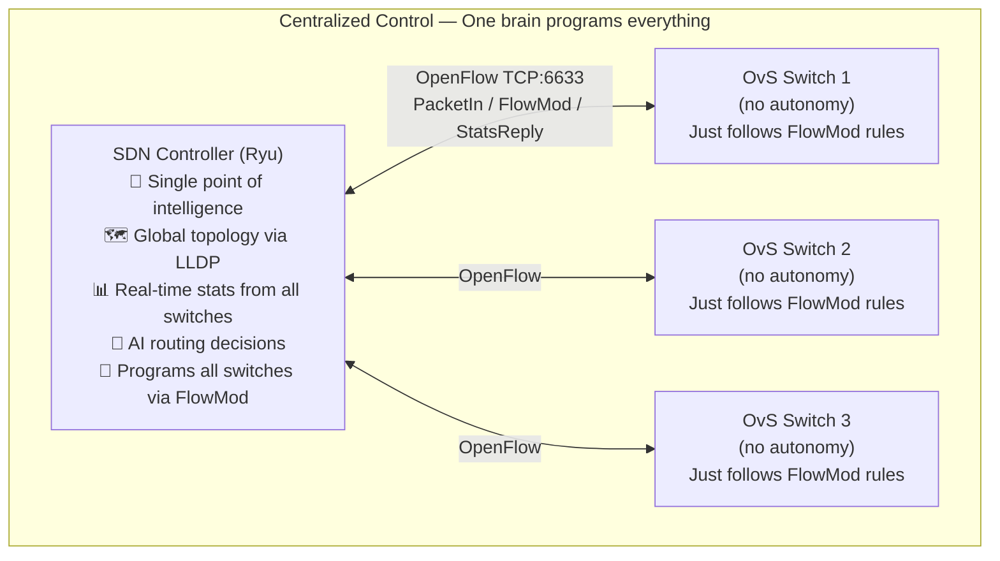

# Centralized vs Distributed Control
### One Brain vs Many Brains — The Architectural Tradeoff

---

## Table of Contents

- [[#1. Intuition|1. Intuition]]
- [[#2. Distributed Control — How Classical Networks Think|2. Distributed Control — How Classical Networks Think]]
- [[#3. Centralized Control — How SDN Thinks|3. Centralized Control — How SDN Thinks]]
- [[#4. The Core Tradeoffs|4. The Core Tradeoffs]]
- [[#5. Consistency and the CAP Theorem|5. Consistency and the CAP Theorem]]
- [[#6. Scalability|6. Scalability]]
- [[#7. Failure Modes|7. Failure Modes]]
- [[#8. Global Optimization vs Local Optimization|8. Global Optimization vs Local Optimization]]
- [[#9. Role in Our Project|9. Role in Our Project]]
- [[#10. Interconnections|10. Interconnections]]
- [[#11. Advanced Insights|11. Advanced Insights]]
- [[#12. References for Further Study|12. References for Further Study]]

---

## 1. Intuition

Think about how two different companies manage their logistics:

**Company A — Distributed (Classical Networking)**
Each warehouse manager makes their own shipping decisions. They talk to neighboring warehouses on the phone to share information about road conditions, but each one ultimately decides independently. If Road 5 is jammed, Manager 3 might know, but Managers 1 and 2 might still be routing shipments there.

**Company B — Centralized (SDN)**
One logistics command center has feeds from all warehouses and all roads simultaneously. It makes all routing decisions. Every warehouse manager just receives instructions: "Ship this package via Route B today." The command center can see the whole picture and optimize globally.

Both systems work. But they have radically different capabilities:
- Company A: resilient (if the phone network dies, each manager can still operate independently), but uncoordinated and cannot optimize globally.
- Company B: globally optimal and instantly responsive to conditions, but vulnerable to command center failure and dependent on the communication link between center and warehouses.

**This is the exact tradeoff between classical networking and SDN.**

---

## 2. Distributed Control — How Classical Networks Think

In a classical network, every router is an autonomous agent that:
1. Makes its own routing decisions
2. Communicates with neighbors to share topology information
3. Runs its own instance of the routing algorithm
4. Updates its own routing table independently

**How they maintain a consistent network view:**

Each router runs the **same protocol** with the same rules. By exchanging topology information (LSAs in OSPF), they independently converge on the same routing table — as long as all LSAs have been propagated everywhere. During this convergence period (seconds to minutes), different routers may have different views of the network and make inconsistent routing decisions.

**Key property:** If the network is partitioned (some routers can no longer reach the controller, or in this case, their neighbors), each router can still forward packets independently using its last-known routing table. The network degrades gracefully.

---

## 3. Centralized Control — How SDN Thinks

In SDN, there is one entity — the controller — that has complete, real-time knowledge of the entire network and makes all forwarding decisions. Switches are passive; they only follow instructions.

**How it maintains consistency:**

There is only one routing decision-maker. Every switch gets its rules from the same source. There is no convergence period — when the controller installs a new FlowMod, that switch's behavior changes immediately. Inconsistency can only arise if different switches have received different FlowMods from the same controller instance (a network-level issue, not an algorithm issue).

**Key property:** If the controller is unreachable, switches fall back to their existing flow table rules (existing flows continue) but new flows are blocked (no more FlowMods for new connections) or flooded (fail-open mode). The network cannot independently adapt.

---

## 4. The Core Tradeoffs

| Property | Distributed (CN) | Centralized (SDN) |
|---|---|---|
| **Global view** | No — each router only sees its own perspective | Yes — single controller sees everything |
| **Consistency** | Eventual — requires convergence time (seconds–minutes) | Immediate — one source of truth |
| **Failure tolerance** | High — each router operates independently | Low — controller failure affects all decisions |
| **Scalability** | High — each device is self-contained, works for 100k+ routers | Limited by controller capacity (needs clustering for large scale) |
| **Optimization quality** | Local — each router optimizes its own forwarding | Global — controller optimizes entire network simultaneously |
| **Intelligence limit** | Fixed algorithms in firmware | Unlimited — any software can run in controller |
| **Configuration** | Per-device, manual | Centralized, programmatic |
| **Reaction speed** | Slow (protocol convergence) | Fast (direct FlowMod push) |
| **AI integration** | Impossible | Natural (controller is just Python code) |

---

## 5. Consistency and the CAP Theorem

The CAP Theorem states that a distributed system can simultaneously guarantee at most two of three properties:

- **C**onsistency — all nodes see the same data at the same time
- **A**vailability — every request gets a response
- **P**artition tolerance — the system keeps operating despite network splits

**Distributed CN falls into AP:** Each router is always available (it can still forward packets) and tolerates partitions (isolated routers keep forwarding based on their last routing table), but sacrifices consistency (different routers may have different views of the network during convergence).

**Centralized SDN falls into CP:** The controller provides a consistent view (all FlowMods come from one source), and the system is partition-tolerant at the data plane level (existing flow rules still work), but sacrifices availability for new flows (if the controller is unreachable, new flows cannot be established).

For our IoT project, **CP is acceptable**: existing sensor or video streams continue on their installed flow rules even during a controller outage. Only new flows are affected. Since our IoT devices send repeated periodic flows, a brief controller outage causes at most one dropped sensor reading — not the catastrophic data loss that would occur if the data plane stopped entirely.

---

## 6. Scalability

### How Classical Networks Scale

Classical routing was designed for planet-scale deployment. The internet has millions of routers. This works because:
- Each router only communicates with its immediate neighbors (O(N) messages, not O(N²))
- OSPF uses **areas** to limit how far LSAs flood — a full OSPF topology is only maintained within an area (typically <50–200 routers); inter-area routing uses summary routes
- BGP scales the internet by having only O(70,000) autonomous systems exchange routes, not individual routers

**Verdict:** Classical routing is proven at internet scale.

### How SDN Scales

A single Ryu controller can handle approximately:
- 300–1,000 switches
- 1,000–10,000 PacketIn events per second
- Polling stats from ~500 switches every 10 seconds

For larger networks, you need **controller clustering**: multiple controller instances sharing state (via a distributed key-value store like ZooKeeper or etcd) and partitioning the switch management across them.

Modern controllers like ONOS and OpenDaylight are designed for production scale with clustering built in.

**For our project:** 3 switches, <20 flows simultaneously. A single Ryu instance is massively over-provisioned. Scalability is not a concern.

---

## 7. Failure Modes

### Classical Network: Distributed Failure Handling

When a router fails in CN:
1. Neighboring routers detect the failure via Hello timeout (~40 seconds standard, ~1 second with fast timers)
2. They generate LSAs advertising that the failed link is down
3. LSAs flood through the network
4. All routers re-run Dijkstra
5. Traffic automatically reroutes via the next-best path

**Resilience:** The network heals automatically. No intervention required. The distributed nature means there's no single point that could take down the entire routing system.

**Cost:** During convergence (up to 3 seconds with fast timers), traffic may be blackholed or looping. Some packets are lost. For IoT where sensor data must not be lost, this is a concern.

### SDN: Controller-Mediated Failure Handling

When a link fails in SDN:
1. The switch detects the link down event (OpenFlow PortStatus message)
2. The switch sends PortStatus to the controller
3. The controller updates its topology graph
4. The controller computes new paths and sends FlowMod updates to all affected switches
5. Switches are updated — traffic reroutes

**Speed:** Steps 4–5 take milliseconds. Faster than OSPF convergence.

**Controller failure (the dangerous case):**
- If the controller goes down, switches stop receiving FlowMod updates
- Existing flows continue on their installed rules (correct forwarding for established conversations)
- New flows (new PacketIn events) get no response from controller → packets dropped (fail-secure mode)
- Recovery requires controller restart + re-synchronization with all switch flow tables

**For our project:** We mitigate controller failure risk by:
1. Running the controller on a reliable cloud VM with auto-restart (`systemctl restart ryu on failure`)
2. Pre-installing permanent rules for the most critical flows (always-active sensors)
3. Configuring OvS with a reasonable default action if controller is unreachable

---

## 8. Global Optimization vs Local Optimization

This is the most direct argument for centralized control in our AI-routing context.

### Local Optimization in CN

Each OSPF router computes the shortest path from **its own perspective**. It doesn't know whether the congested link 3 hops away is a temporary burst or a permanent overload. It doesn't know that Path A is heavily loaded with an elephant flow because some other router's decision sent that flow there.

The result: **a locally rational decision at every router, but globally suboptimal routing**. Classic examples:
- OSPF hot-potato routing: a router forwards a packet to the path that exits its network fastest, even if this puts more load on the next router's links
- Routing oscillation: two routers interdependently adjust their paths and end up oscillating between two states rather than converging

### Global Optimization in SDN

The controller sees:
- All switch port utilizations simultaneously
- All active flows and their current paths
- All queue depths and jitter measurements
- The full topology with all link capacities

It can answer questions that no individual router in CN can answer:
- "Where is the total network utilization minimized if I route this flow to Path B?"
- "Which path gives this emergency sensor the minimum latency given all 12 currently active flows?"
- "What is the globally fair allocation of bandwidth across all active IoT device flows?"

In our project, the [[DQN_Model|DQN AI agent]] uses the 20-feature state vector — which represents this global network view — to make routing decisions that optimize holistically. This is only possible because centralized control gives us that global view.

---

## 9. Role in Our Project

The choice of centralized SDN control is the **enabling architecture** for everything else in our project.

Without centralized control, there is no:
- Global state vector (the AI has no holistic network view)
- Per-flow routing differentiation at the network level
- AI-driven routing (nowhere to put the neural network)
- Dynamic policy switching for the demo
- Coordinated reward computation (no single entity sees both the routing decision and its outcome)

The centralized controller is where the AI lives, where network state is assembled, where routing decisions are made, and where routing outcomes are measured. It is the architectural cornerstone enabling every feature that distinguishes our system from classical networking.

---

## 10. Interconnections

- [[CN_vs_SDN]] — main comparison file this feeds into
- [[Control_Plane_vs_Data_Plane]] — centralized vs distributed maps directly onto where the control plane lives
- [[Routing_Protocols_CN]] — OSPF and BGP are the protocols that implement distributed control
- [[Network_Programmability]] — centralized control is the prerequisite for AI programmability
- [[SDN_Controller]] *(in Knowledge_System/)* — the Ryu controller that IS our centralized control implementation
- [[DQN_Model]] *(in Knowledge_System/)* — lives in the centralized control plane; impossible in distributed CN

---

## 11. Advanced Insights

### Logically Centralized vs Physically Centralized

SDN is often described as having a "logically centralized" control plane, but this may be physically distributed for resilience. Production SDN deployments run:
- Multiple controller instances (typically 3 or 5 for consensus)
- Distributed state storage (etcd, ZooKeeper) for shared topology and flow information
- Load balancer distributing switch connections across controller instances

The switches see one logical controller (same vIP address) even though physically there are multiple hosts running the controller software. If one controller instance fails, another takes over in seconds — switches don't notice.

**The key distinction:** Logically centralized (consistent global view) ≠ physically centralized (single point of failure). Our project uses physically centralized (one Ryu VM) for simplicity, but production deployments would use the distributed-but-logically-centralized pattern.

### The Floodlight Problem

In very large SDN networks, the centralized controller can become a **bottleneck**. Every new flow's first packet goes to the controller. If 100,000 new flows start simultaneously (e.g., immediately after a network restart), the controller receives a **PacketIn storm** — more events than it can handle.

Mitigations:
- **Proactive flow installation:** The controller pre-installs rules before flows start (no PacketIn needed)
- **Caching controllers:** Edge controllers handle PacketIn events and cache decisions, only consulting the central controller for unknown traffic
- **Graduated Table-Miss:** Instead of sending the entire packet to the controller, the switch only sends packet metadata — reducing PacketIn message size

### Hybrid Control: SDN and BGP Together

Modern networks don't choose exclusively between CN and SDN — they often use both together:
- **BGP** handles inter-domain routing (internet-scale, distributed resilient)
- **SDN** handles intra-domain routing (within the network, globally optimized, AI-driven)

This is actually the production architecture at major internet companies: Google's B4 WAN and Facebook's FB-WAN use SDN internally while using BGP to peer with the rest of the internet.

---

## 12. References for Further Study

- **CAP Theorem** — Brewer, "Towards Robust Distributed Systems" (2000) — foundational distributed systems constraint
- **Google B4** — Jain et al., "B4: Experience with a Globally-Deployed Software Defined WAN" (SIGCOMM 2013) — real-world large-scale SDN deployment
- **ONOS (Open Network Operating System)** — distributed SDN controller architecture designed for carrier-scale
- **ZooKeeper** — the distributed coordination service used by ONOS for consensus among controller instances
- **Topics to explore:** Byzantine fault-tolerant distributed systems, Paxos/RAFT consensus algorithms (used in controller clustering), Economic analysis of centralized vs distributed systems (principal-agent problem)
