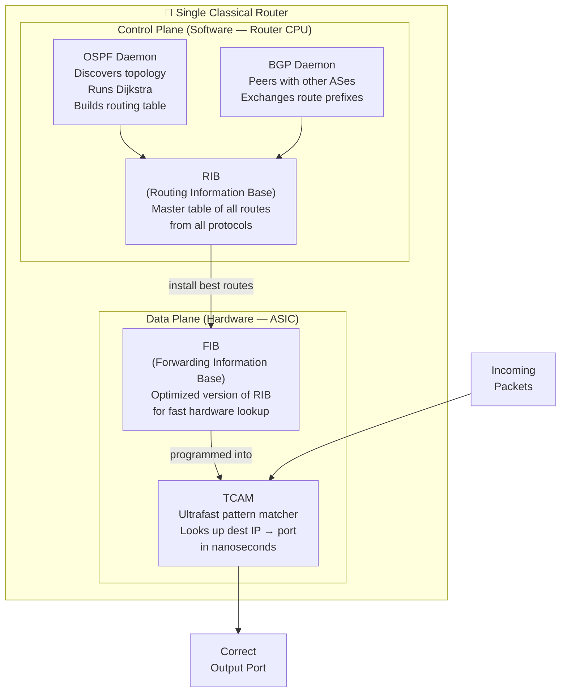
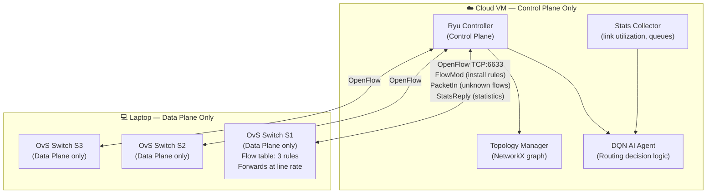

# Control Plane vs Data Plane
### The Most Fundamental Concept in Modern Networking

---

## Table of Contents

- [[#1. Intuition|1. Intuition]]
- [[#2. What is the Data Plane?|2. What is the Data Plane?]]
- [[#3. What is the Control Plane?|3. What is the Control Plane?]]
- [[#4. How They Work Together in Classical Networking|4. How They Work Together in Classical Networking]]
- [[#5. How SDN Separates Them|5. How SDN Separates Them]]
- [[#6. Why Separation is So Powerful|6. Why Separation is So Powerful]]
- [[#7. The Management Plane (Third Plane)|7. The Management Plane (Third Plane)]]
- [[#8. Role in Our Project|8. Role in Our Project]]
- [[#9. Interconnections|9. Interconnections]]
- [[#10. Advanced Insights|10. Advanced Insights]]
- [[#11. References for Further Study|11. References for Further Study]]

---

## 1. Intuition

Think of a large hospital.

The **Data Plane** is like the hospital porters and nurses who physically move patients from room to room, run tests, deliver medications. They do the actual work at high speed — no time to think, just follow instructions.

The **Control Plane** is like the hospital administration — the scheduling system, the doctors who decide which room each patient goes to, which treatment is needed. They don't carry the patients themselves; they make the decisions.

In a **classical network (CN):** every individual nurse (switch/router) is also their own administrator. Each one independently decides what to do with each patient (packet) by running their own routing protocol. They coordinate with each other nurse by exchanging memos (routing advertisements), but there is no central administrator.

In an **SDN:** there is one central hospital administration system (the controller). Every nurse simply follows the instructions it sends. The administration sees the entire hospital at once and can instantly reassign patients from one wing to another.

The key insight: **you can upgrade the administration system** without retraining every nurse. The nurses just follow whatever instructions they receive.

---

## 2. What is the Data Plane?

The Data Plane (also called the **Forwarding Plane**) is the part of a network device responsible for the actual movement of packets.

**What it does:**
- Receives packets on input interfaces
- Looks up the destination in a table (routing table or flow table)
- Forwards the packet out the correct output interface
- Applies actions: increment TTL, rewrite DSCP, strip/add VLAN tags

**Key characteristics:**
- Must operate at **line rate** — gigabits per second, no time to think
- Implemented in **hardware**: ASICs (Application-Specific Integrated Circuits) or specialized FPGAs
- The lookup table is stored in fast TCAM (Ternary Content Addressable Memory)
- Stateless (mostly): each packet is processed independently based on its headers

**In an OvS switch (our project):**
```
Packet arrives on port 1 (from ESP32 sensor)
    ↓
TCAM lookup: match {udp_dst=5005, ip_dst=10.0.0.10} → action: output port 3
    ↓
Packet forwarded out port 3 at full link speed (5 Mbps)
Time elapsed: ~microseconds
```

The data plane does not know why port 3 was chosen. It does not know what Path B is, or that the elephant flow is currently saturating Path A. It just follows the rule installed by the control plane.

---

## 3. What is the Control Plane?

The Control Plane is the part of a network device (or in SDN, a separate system) responsible for **deciding how packets should be forwarded**.

**What it does:**
- Discovers network topology (which links exist, which are up/down)
- Computes optimal paths using routing algorithms (Dijkstra, Bellman-Ford)
- Populates the forwarding tables that the Data Plane uses
- Responds to failures by recomputing paths and updating tables
- Implements policies (traffic engineering, QoS)

**Key characteristics:**
- Does NOT touch individual packets (except in edge cases like routing protocol packets)
- Operates on a **slower timescale** — seconds to minutes for protocol convergence
- Implemented in **software**: routing daemon processes running on the router's CPU
- Stateful: maintains topology databases, routing tables, adjacency lists

**In a classical OSPF router:**
```
OSPF daemon running on router CPU:
    Sends Hello packets every 10 seconds
    Receives Link State Advertisements from neighbors
    Runs Dijkstra: computes shortest path to every destination
    Writes result to routing table:
        10.0.0.10/32  →  via eth1  (metric: 20)
        10.0.0.11/32  →  via eth2  (metric: 25)
    Data plane (ASIC) reads this table for packet forwarding
```

---

## 4. How They Work Together in Classical Networking

In a classical router, **both planes live in the same physical box**:



This tight coupling has advantages (no network needed between planes, simpler failure model) but critical limitations for our project:
- You cannot upgrade the routing algorithm without updating every router's firmware
- You cannot inject AI-computed routes without vendor support
- No single point with global network visibility

---

## 5. How SDN Separates Them

SDN physically separates the control and data planes onto different machines:



**The OpenFlow channel is the new interface between planes.**

Every time the control plane (Ryu) decides on a forwarding rule, it sends it to the data plane (OvS) as a **FlowMod** message. Every time the data plane encounters a packet with no matching rule, it sends it to the control plane as a **PacketIn** message and waits for instructions.

The data plane switches (OvS on the laptop) are now very simple:
- No OSPF daemon
- No routing table computation
- No adjacency discovery
- Just: look up packet in flow table → apply action → forward

---

## 6. Why Separation is So Powerful

The separation of control and data planes unlocks capabilities that are impossible in CN:

### Global Network Visibility

In CN: each router only sees its own interfaces and the prefixes advertised by its nearest neighbors. It has no direct knowledge of link utilization on a link 3 hops away.

In SDN: the controller polls every switch every 2 seconds. It has a **real-time, global view** of every link's utilization, every queue's depth, every active flow's path. This is the foundation of our AI's 20-feature state vector.

### Instant Policy Updates

In CN: changing a routing policy means logging into every router via CLI and manually editing configurations. A network-wide change takes hours and risks human error.

In SDN: the controller sends new FlowMod messages to all switches. A routing policy change propagates to all 3 switches in our network in under 100 milliseconds.

In our demo: we can switch between Shortest Path, ECMP, and AI routing with a single REST API call to the controller. The audience sees the change take effect instantly on the dashboard.

### Arbitrary Routing Logic

In CN: the routing algorithm is fixed. OSPF always runs Dijkstra on hop count. You cannot replace the algorithm.

In SDN: the controller is a Python program. The routing logic is the function `_get_routing_decision()`. We can swap that function to call a neural network, ECMP logic, or any other algorithm — without changing anything in the switches.

### Programmability for AI

In CN: AI routing is theoretically possible but practically impossible — you'd need to replace the firmware of every router.

In SDN: integrating AI is 10 lines of Python in the controller:
```python
response = requests.post(AI_API_URL + "/api/routing", json=state)
action = response.json()['action']
```

---

## 7. The Management Plane (Third Plane)

There is often a third plane mentioned alongside control and data: the **Management Plane**.

| Plane | Function | In CN | In SDN |
|---|---|---|---|
| Data Plane | Forward packets | ASIC/FIB/TCAM | OvS flow tables |
| Control Plane | Decide forwarding rules | OSPF/BGP daemons | Ryu + DQN agent |
| Management Plane | Configure and monitor the system | CLI, SNMP, NetFlow | REST API, WebSocket dashboard |

In our project:
- **Data Plane:** Open vSwitch on the laptop
- **Control Plane:** Ryu controller + DQN AI agent on the cloud VM
- **Management Plane:** Flask REST API (for policy switching and reward submission) + D3.js dashboard (for monitoring)

---

## 8. Role in Our Project

Understanding the control/data plane split explains **every architectural decision** in our project:

| Decision | Reason |
|---|---|
| Ryu runs on the cloud VM, OvS runs on the laptop | Control plane and data plane are physically separated, as SDN requires |
| OvS does not compute routes itself | OvS is a pure data plane device; it waits for FlowMod rules from Ryu |
| The DQN agent runs in the cloud VM, not in the switch | AI is part of the control plane — it is too complex and slow for the data plane |
| Stats are polled from OvS by Ryu every 2s | Only the control plane has the full picture needed for AI decision-making |
| PacketIn events go to Ryu, not to a local routing daemon | There is no local routing daemon — the control plane is fully centralized |
| FlowMod updates propagate instantly | Control-plane decisions are pushed to the data plane via OpenFlow in milliseconds |

If you understand the control/data plane separation, you understand why the entire system is architected the way it is.

---

## 9. Interconnections

- [[CN_vs_SDN]] — the main comparison file that contextualizes this concept
- [[Routing_Protocols_CN]] — how classical networks implement control-plane routing (OSPF, BGP)
- [[Flow_Tables_SDN]] — how SDN data planes use flow tables instead of routing tables
- [[Centralized_vs_Distributed_Control]] — the consequence of where the control plane lives
- [[Network_Programmability]] — why SDN's separated control plane enables AI integration
- [[SDN_Controller]] *(in Knowledge_System/)* — the Ryu controller that IS our control plane
- [[OpenFlow_Protocol]] *(in Knowledge_System/)* — the protocol bridging our control and data planes

---

## 10. Advanced Insights

### Why the Data Plane Must Stay Fast

The data plane handles every packet — potentially millions per second. For a 5 Mbps link with 1400-byte packets:
```
Packets per second = 5,000,000 / (1400 × 8) ≈ 446 packets/sec per link
```

With 3 links each potentially carrying this much traffic: ~1,338 packets/sec through our network. Each packet needs a forwarding decision in microseconds. This is why the data plane must use hardware (ASIC/TCAM) — software lookups in a routing daemon are too slow.

The control plane, by contrast, only handles **new flows** (the first packet per flow). With 10 IoT devices each starting a flow once every minute, that's: 10/60 = 0.17 control-plane events/sec. The controller has tens to hundreds of milliseconds to respond to each one.

This is the fundamental reason the separation works: the data plane needs to be fast but simple, and the control plane can be slow but complex.

### The Residual Coupling Problem

Even in SDN, the control and data planes are not perfectly decoupled. The data plane's **flow table capacity is finite** — OvS can only store a limited number of flow rules (typically thousands to tens of thousands). If the controller tries to install more rules than the table can hold, old rules are evicted (based on priority or LRU policy).

For our small experiment (3 switches, ~10 active flows), this is not a concern. For a production SDN with millions of flows, this is a genuine engineering challenge — one reason why wildcard rules (matching many flows with one rule) are preferred over per-flow exact-match rules.

---

## 11. References for Further Study

- **OpenFlow specification** — ONF (Open Networking Foundation) — formal definition of the control/data plane interface
- **RFC 3654** — "Requirements for Separation of IP Control and Forwarding" — the IETF perspective on plane separation
- **MPLS (Multiprotocol Label Switching)** — a CN technology that partially separates control and data planes years before SDN
- **P4 language** — a language for programming the data plane directly; complements SDN by making switching hardware programmable
- **NFV (Network Function Virtualization)** — related concept: virtualizing control-plane network functions (firewalls, load balancers) in software
- **Topics to explore:** Hardware-based control plane acceleration (SmartNICs), In-band network telemetry (INT) for data-plane measurement, Programmable pipelines in RMT (Reconfigurable Match-Action Tables)
