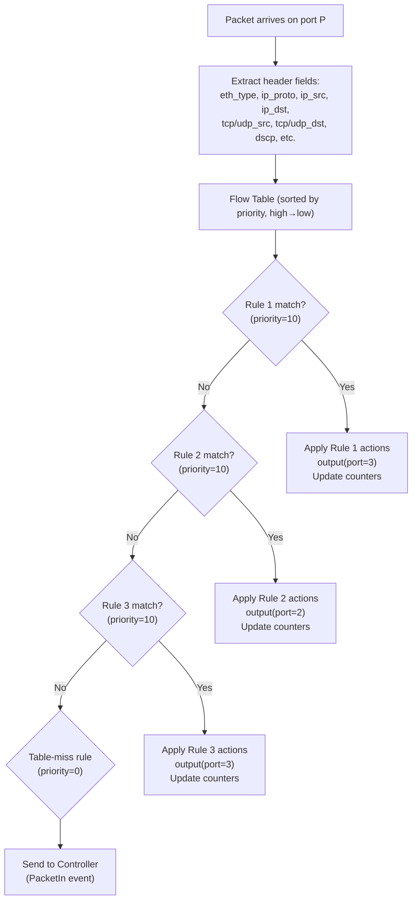

# Flow Tables in SDN
### The Radical Upgrade Over Classical Routing Tables

---

## Table of Contents

- [[#1. Intuition|1. Intuition]]
- [[#2. Classical Routing Table — What It Can Do|2. Classical Routing Table — What It Can Do]]
- [[#3. SDN Flow Table — What It Can Do|3. SDN Flow Table — What It Can Do]]
- [[#4. Anatomy of a Flow Table Entry|4. Anatomy of a Flow Table Entry]]
- [[#5. The Match-Action Pipeline|5. The Match-Action Pipeline]]
- [[#6. Priority and Conflict Resolution|6. Priority and Conflict Resolution]]
- [[#7. Timeouts and Flow Lifecycle|7. Timeouts and Flow Lifecycle]]
- [[#8. How the AI Uses Flow Tables|8. How the AI Uses Flow Tables]]
- [[#9. Role in Our Project|9. Role in Our Project]]
- [[#10. Interconnections|10. Interconnections]]
- [[#11. Advanced Insights|11. Advanced Insights]]
- [[#12. References for Further Study|12. References for Further Study]]

---

## 1. Intuition

A classical routing table is like a **city directory** indexed only by street name (destination). If you look up "Main Street," you get one address — regardless of whether you're sending a letter, a package, a truck, or an ambulance. Everything going to Main Street follows the same route.

An SDN flow table is like a **traffic management system** with full knowledge of vehicle type, time of day, payload, and current road conditions. An ambulance gets a priority lane. A truck gets directed to an industrial route. A bicycle gets the scenic path. Each is a separate rule.

The jump from routing table to flow table is the jump from **blind destination-based forwarding** to **context-aware per-flow forwarding**. This single change is what makes AI-driven IoT routing possible.

---

## 2. Classical Routing Table — What It Can Do

### What a routing table entry looks like

```
╔══════════════════════╦═══════════════╦═══════════╦══════════════╗
║ Destination Network  ║ Prefix Length ║ Next Hop  ║ Interface    ║
╠══════════════════════╬═══════════════╬═══════════╬══════════════╣
║ 10.0.0.0             ║ /24           ║ 192.168.1 ║ eth1         ║
║ 10.0.1.0             ║ /24           ║ 192.168.2 ║ eth2         ║
║ 0.0.0.0              ║ /0 (default)  ║ 192.168.0 ║ eth0         ║
╚══════════════════════╩═══════════════╩═══════════╩══════════════╝
```

### What it can match on

**Only the destination IP address.** Nothing else.

- ✅ "Where is this packet going?"
- ❌ "Who sent this packet?"
- ❌ "What application is this?"
- ❌ "Is this TCP or UDP?"
- ❌ "What port number is the source or destination?"
- ❌ "How large is this packet?"
- ❌ "Is this flow high-priority?"

### The consequence

Every packet to the same destination IP takes the same path. A 100-byte temperature reading and a 500 MB firmware update both destined for `10.0.0.10` follow an identical route. The routing table cannot distinguish them, cannot treat them differently, and cannot reroute one while keeping the other.

---

## 3. SDN Flow Table — What It Can Do

### What a flow table entry looks like

```
╔══════════════════════════════════════╦════════════════════╦══════════════╗
║ Match Fields                         ║ Actions            ║ Priority     ║
╠══════════════════════════════════════╬════════════════════╬══════════════╣
║ in_port=1                            ║ output(port=3)     ║ 10           ║
║ eth_type=0x0800 (IPv4)               ║                    ║              ║
║ ip_proto=17 (UDP)                    ║                    ║              ║
║ ip_dst=10.0.0.10                     ║                    ║              ║
║ udp_dst=5005  ← SENSOR PORT          ║                    ║              ║
╠══════════════════════════════════════╬════════════════════╬══════════════╣
║ in_port=1                            ║ output(port=2)     ║ 10           ║
║ eth_type=0x0800                      ║                    ║              ║
║ ip_proto=6 (TCP)                     ║                    ║              ║
║ ip_dst=10.0.0.10                     ║                    ║              ║
║ tcp_dst=5007  ← ELEPHANT PORT        ║                    ║              ║
╠══════════════════════════════════════╬════════════════════╬══════════════╣
║ in_port=1                            ║ output(port=3)     ║ 10           ║
║ eth_type=0x0800                      ║                    ║              ║
║ ip_proto=17                          ║                    ║              ║
║ ip_dst=10.0.0.10                     ║                    ║              ║
║ udp_dst=5006  ← VIDEO PORT           ║                    ║              ║
╠══════════════════════════════════════╬════════════════════╬══════════════╣
║ (table-miss: anything else)          ║ → Controller       ║ 0 (lowest)   ║
╚══════════════════════════════════════╩════════════════════╩══════════════╝
```

Notice: the **sensor** → port 3 (Path B), the **elephant** → port 2 (Path A), the **video** → port 3 (Path B). Three packets all going to the same IP address `10.0.0.10` are forwarded to **different ports** because the AI decided this is optimal given current network conditions.

### What it can match on (OpenFlow 1.3)

| Match Field | Classical Routing Table? | SDN Flow Table? |
|---|---|---|
| Destination IP address | ✅ | ✅ |
| Source IP address | ❌ | ✅ |
| IP protocol (TCP/UDP/ICMP) | ❌ | ✅ |
| TCP/UDP source port | ❌ | ✅ |
| TCP/UDP destination port | ❌ | ✅ |
| VLAN ID | ❌ | ✅ |
| DSCP / ECN bits | ❌ | ✅ |
| Ethernet source MAC | ❌ | ✅ |
| Ethernet destination MAC | ❌ | ✅ |
| MPLS label | ❌ | ✅ |
| Physical input port | ❌ | ✅ |

SDN can match on **any combination** of these 12+ fields simultaneously. The combination of matching fields that uniquely identifies one traffic stream is called a **flow** — hence flow table.

---

## 4. Anatomy of a Flow Table Entry

Every entry in an OvS flow table has exactly three parts:

### Part 1: Match Fields
The conditions that define which packets this rule applies to. Uses **wildcards** for fields that should be ignored:

```python
# In Ryu Python — build a match object
match = parser.OFPMatch(
    eth_type=0x0800,      # IPv4
    ip_proto=17,          # UDP
    ipv4_dst='10.0.0.10',
    udp_dst=5005          # Sensor port
)
# Fields NOT specified (e.g., ipv4_src, udp_src) are wildcards — match any value
```

### Part 2: Actions (Instructions)
What to do with matching packets:

| Action | Effect |
|---|---|
| `output(port=N)` | Forward out port N |
| `output(FLOOD)` | Forward out all ports except ingress |
| `output(CONTROLLER)` | Send copy to controller (PacketIn) |
| `drop` | Silently discard the packet |
| `set_field(ip_dscp=46)` | Modify packet header field before forwarding |
| `push_vlan(vid=100)` | Add a VLAN tag |
| `group(id=1)` | Apply a group action (multicast, failover) |

### Part 3: Counters
Statistics maintained automatically by OvS for each installed rule:
- `packet_count`: total packets matched
- `byte_count`: total bytes matched
- `duration_sec` / `duration_nsec`: how long the rule has been active

These counters are what the [[SDN_Controller|Ryu controller]] reads via StatsRequest to compute per-flow packet loss rates and throughput — used in the [[Reward_Function|reward calculation]].

---

## 5. The Match-Action Pipeline

When a packet arrives at an OvS switch, the flow table processing is:



The lookup happens in hardware (TCAM — Ternary Content-Addressable Memory) in nanoseconds. The table-miss case (PacketIn to controller) is the slow path — only triggered for the first packet of each new flow.

---

## 6. Priority and Conflict Resolution

Two rules can potentially match the same packet (e.g., Rule A: match all UDP; Rule B: match UDP to port 5005). In classical routing, longer prefix match wins. In SDN: **highest numeric priority wins**.

```
Rule A: match eth_type=IPv4, ip_proto=UDP           → output(port=2)   priority=5
Rule B: match eth_type=IPv4, ip_proto=UDP, udp_dst=5005 → output(port=3)   priority=10

Packet: UDP to dst_port=5005
    Both rules match!
    Priority 10 > priority 5 → Rule B wins → output(port=3)
```

**For our project:** Traffic classification rules (matching specific src/dst ports) are installed at higher priority (e.g., 10) than catch-all rules (priority 5). The table-miss rule is always priority 0 — it only fires when nothing else matches.

This allows **layered policy** — broad rules for general traffic with specific overrides for priority flows, IoT device types, or emergency alerts.

---

## 7. Timeouts and Flow Lifecycle

SDN flow rules are not permanent by default. They can be given two types of timeouts:

### Idle Timeout
The rule expires if **no matching packet** is received for N seconds.

```
idle_timeout=30
→ If no sensor packet arrives for 30 seconds, delete this rule
→ Next sensor packet → table-miss → PacketIn → AI makes a fresh routing decision
```

**Purpose:** Forces periodic re-evaluation of routing decisions. If network conditions changed significantly while a flow was quiet (e.g., the elephant flow ended), the next packet of that flow triggers a fresh AI decision with current network state — not a stale decision from 5 minutes ago.

### Hard Timeout
The rule expires unconditionally after N seconds, regardless of traffic.

```
hard_timeout=120
→ After 120 seconds, delete this rule no matter what
→ Forces re-evaluation of long-running flows (video streams, elephant flows)
```

**Purpose:** Ensures the AI gets to re-evaluate even continuously active flows as conditions evolve.

### Timeout Strategy in Our Project

| Traffic Type | Idle Timeout | Hard Timeout | Reasoning |
|---|---|---|---|
| Sensor (periodic, every 5s) | 30s | 120s | Idle timeout catches quiet periods; hard timeout catches gaps |
| Video (continuous) | 60s | 0 (never) | Video never goes idle, so only hard timeout forces re-evaluation |
| Elephant (bulk TCP) | 0 (never) | 120s | Elephant is always active; hard timeout gives AI fresh decision every 2 min |
| Infrastructure (ARP) | 0 | 0 | Permanent rules for non-routable traffic |

---

## 8. How the AI Uses Flow Tables

The [[DQN_Model|DQN AI agent]] interacts with flow tables through a specific lifecycle:

```
1. First packet of new flow → table-miss → PacketIn to Ryu
2. Ryu classifies flow → queries AI → gets action (e.g., PathB → port 3)
3. Ryu sends FlowMod to OvS:
   - match: specific 5-tuple of this flow
   - action: output(port=3)
   - idle_timeout: 30, hard_timeout: 120
4. OvS installs the rule in its TCAM
5. All subsequent packets forwarded at hardware speed — AI not consulted again
6. At flow end (detected via StatsReply counter stopping):
   - Ryu computes reward: bytes delivered, delay measured, loss rate from counters
   - Ryu submits reward to AI API
   - AI stores (state, action, reward, next_state) in Replay Buffer
   - AI trains on the experience
7. When rule expires (timeout):
   - Next packet → table-miss → new AI decision with fresh network state
```

The flow table acts as the **execution memory** of the AI's decisions. When the AI says "route this flow to Path B," that decision is written into the flow table and enforced by hardware for the duration of the flow — without the AI being consulted for every packet.

---

## 9. Role in Our Project

Flow tables are the mechanism that makes three critical things work:

**1. Per-traffic-type routing:** By matching on `udp_dst=5005`, `udp_dst=5006`, and `tcp_dst=5007` respectively, the controller can install completely different forwarding rules for sensors, video, and elephant flows — even when they share the same destination IP address.

**2. Hardware-speed forwarding after AI decision:** The AI's forward pass takes ~10ms. If the AI were consulted for every packet, the system could not forward more than 100 packets/second. But with flow tables, the AI is only consulted once per flow — after which OvS handles millions of packets per second at hardware speed.

**3. Measurement of AI outcomes:** The flow table's counters (packet_count, byte_count, duration) provide the raw data for reward computation. The AI can measure whether its routing decision was good by comparing the flow's actual statistics against what was expected for a well-routed flow of that type.

---

## 10. Interconnections

- [[CN_vs_SDN]] — the master comparison showing why routing tables vs flow tables matters
- [[Control_Plane_vs_Data_Plane]] — flow tables live in the data plane; FlowMod messages come from the control plane
- [[Routing_Protocols_CN]] — shows the classical routing table that flow tables replace
- [[Centralized_vs_Distributed_Control]] — flow tables are programmed centrally (controller); routing tables are built locally (protocol)
- [[OpenFlow_Protocol]] *(in Knowledge_System/)* — FlowMod, StatsRequest, StatsReply are the OpenFlow messages used to manage flow tables
- [[SDN_Controller]] *(in Knowledge_System/)* — Ryu installs FlowMod rules and reads StatsReply counters
- [[Feature_Engineering]] *(in Knowledge_System/)* — flow table counters are the raw source for state features like packet loss and throughput

---

## 11. Advanced Insights

### TCAM — Why Flow Table Lookup Is Fast

Ordinary RAM lookups check data sequentially or via hashing. TCAM (Ternary Content-Addressable Memory) does something fundamentally different: it checks **all entries in parallel in a single clock cycle**.

For each match field, TCAM stores three values per bit:
- 0 (match only if bit is 0)
- 1 (match only if bit is 1)
- X (wildcard: match regardless)

A 12-field match across full 128-bit IPv6 addresses in a 1,000-rule table is resolved in nanoseconds — impossible with sequential RAM lookups.

**Cost:** TCAM is expensive (power, area, $$$) which is why physical switches have limited flow table sizes (typically 1,000–100,000 entries). OvS (software) has much larger capacity but slower lookup speed.

### Flow Aggregation

For scalability in large networks, individual per-flow rules (one entry per src/dst/port 5-tuple) are replaced with **wildcard rules** that match many flows:

```
Per-flow rule:   src=10.0.0.1, dst=10.0.0.10, udp_dst=5005  → port 3  (1 flow)
Wildcard rule:   udp_dst=5005  → port 3                                  (ALL sensors → Path B)
```

A wildcard rule trades routing precision for scalability. In our project, we use specific 5-tuple rules for precise per-flow tracking (needed for reward calculation), but in a production deployment, wildcard rules would reduce the number of FlowMod messages and flow table entries dramatically.

---

## 12. References for Further Study

- **OpenFlow 1.3 specification** — Open Networking Foundation — complete flow table specification
- **OvS documentation** — openvswitch.org — OvS-specific flow table features and limitations
- **TCAM architecture** — Srinivasan & McKeown, "Packet Classification on Multiple Fields" (1999)
- **P4 language** — p4.org — a programmable data-plane language that goes beyond OpenFlow flow tables
- **Topics to explore:** Multiple flow table pipelines in OpenFlow 1.3, Group tables (multicast and failover), Meter tables (rate limiting), Stateful data planes (storing per-flow state in the switch itself without controller involvement)
