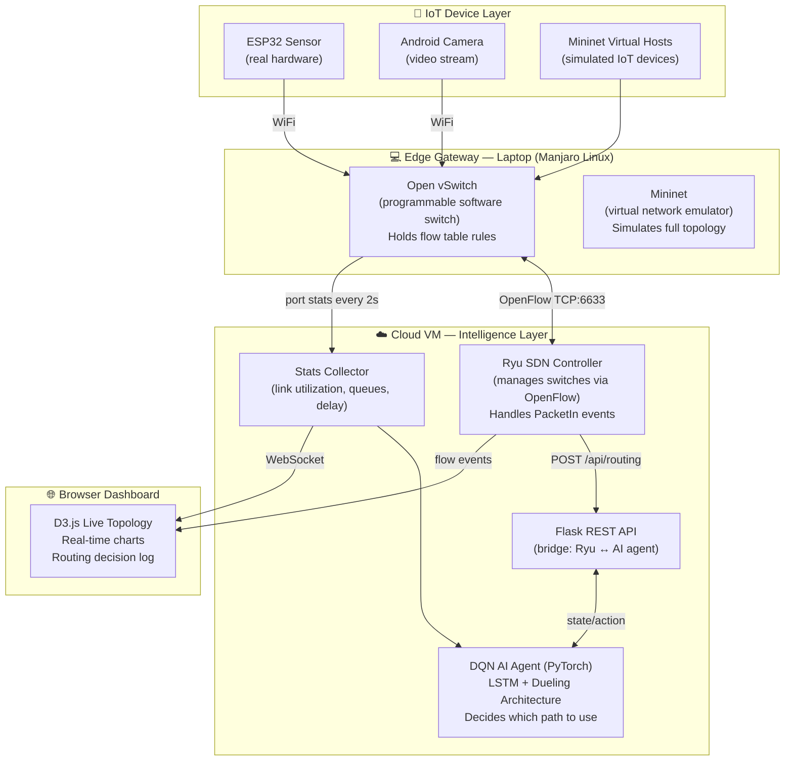
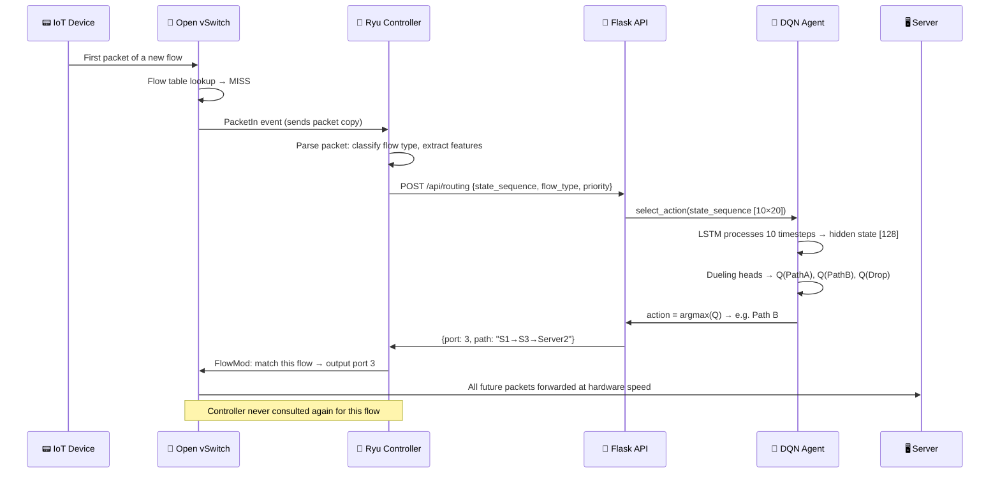
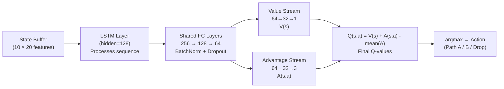
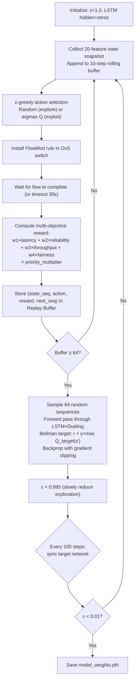

# AI-Driven SDN for IoT — Master Knowledge File
### *The complete end-to-end understanding of the system*

---

## Table of Contents

- [[#1. Big Picture Overview|1. Big Picture Overview]]
- [[#2. System Architecture|2. System Architecture]]
- [[#3. Data Flow — End to End|3. Data Flow — End to End]]
- [[#4. AI Model Explanation|4. AI Model Explanation]]
- [[#5. Training Pipeline|5. Training Pipeline]]
- [[#6. Decision Making Flow|6. Decision Making Flow]]
- [[#7. Real-World Example — Packet Journey|7. Real-World Example — Packet Journey]]
- [[#8. Limitations and Tradeoffs|8. Limitations and Tradeoffs]]
- [[#9. Future Improvements|9. Future Improvements]]
- [[#10. File Index|10. File Index]]

---

## 1. Big Picture Overview

### Intuitive Explanation

A hospital network has hundreds of IoT devices all sharing the same cables:
- A temperature sensor sending a 100-byte reading every 5 seconds
- A security camera streaming 3 Mbps of HD video continuously
- A server pulling a 500 MB firmware update in the background
- An emergency cardiac monitor that must always reach the server instantly

Traditional routers treat all of these exactly the same — they pick the shortest path and shove everything down it. When the firmware download monopolizes the link, the emergency alert is delayed. This is catastrophically wrong.

**Our system fixes this by combining two ideas:**

1. **[[SDN_Controller|Software Defined Networking (SDN)]]** — Separate the network's "brain" from its "muscles." One central controller sees the entire network and programs all switches with specific rules.
2. **[[DQN_Model|Deep Q-Network (DQN)]]** — Give the brain AI. Instead of following fixed rules, the controller learns from experience which routing decisions lead to the best outcomes.

### Technical Framing

The system is a **Markov Decision Process (MDP)** applied to network routing:

| MDP Component | Network Equivalent |
|---|---|
| State `s` | 20 network features (utilization, queues, jitter, flow counts) |
| Action `a` | Choose path: A (S1→S2), B (S1→S3), or drop |
| Reward `r` | Weighted combination of latency, reliability, throughput, fairness |
| Policy `π` | Dueling LSTM-DQN neural network |
| Environment | Mininet + Open vSwitch + real IoT devices |

The agent improves its policy iteratively using the **Bellman equation**, converging toward routing decisions that maximize long-term network performance.

---

## 2. System Architecture

The system has four physical layers:



**Key design decision:** The AI lives entirely in the cloud VM. The switches (laptop) are dumb — they just follow rules installed by the controller. This means the AI can be upgraded without touching any hardware.

---

## 3. Data Flow — End to End

### Step-by-step for a new flow



### The critical insight about flow tables

The controller is only consulted for **the first packet** of each new flow. After a FlowMod installs the rule in OvS, all subsequent packets of that flow are forwarded directly by the switch at hardware speed — no controller bottleneck.

This is [[OpenFlow_Protocol|OpenFlow's]] reactive mode. It scales because the AI overhead is amortized across the entire flow duration, not paid per-packet.

---

## 4. AI Model Explanation

### Basic Model (Starting Point)

The basic [[DQN_Model]] takes 8 state features and maps them through two hidden layers (64 neurons each) to 3 Q-values.

```
Input [8] → Linear(64) → ReLU → Linear(64) → ReLU → Output [3 Q-values]
```

### Upgraded Model (What We Actually Use)

The upgraded model has **5 axes of improvement** over the basic model:

| Axis | Upgrade | Addresses |
|---|---|---|
| 1 | [[Feature_Engineering\|Richer State Inputs]] (8 → 20 features) | Missing context about flows, jitter, trends |
| 2 | Deeper network (BatchNorm + Dropout) | Overfitting, training instability |
| 3 | [[Dueling_DQN\|Dueling DQN Architecture]] | Value/Advantage entanglement |
| 4 | [[LSTM_Memory\|LSTM Temporal Memory]] | No memory of past states |
| 5 | [[Reward_Function\|Multi-Objective Reward Shaping]] | Oversimplified optimization target |

**Full architecture data flow:**



---

## 5. Training Pipeline

Training happens **offline** in a Mininet simulation before the live demo. The loop:



**Training time:** ~3,000–5,000 episodes × 2–5 seconds each = **2–7 hours overnight**.

See [[Training_Process]] for the full deep-dive.

---

## 6. Decision Making Flow

When a packet arrives, the decision process is:

1. **Classify the flow** — Is this sensor (UDP:5005), video (UDP:5006), or elephant (TCP:5007)?
2. **Check priority** — Is `priority_flag = 1` (emergency device)?
3. **Build state** — Collect all 20 features from OvS stats + system clock
4. **Query AI** — Pass 10-step sequence buffer to LSTM-DQN
5. **Get Q-values** — Three numbers: how good is Path A, B, or Drop?
6. **Select action** — Pick highest Q. Install FlowMod.
7. **Receive reward** — After flow ends, compute weighted reward and store experience
8. **Train** — Periodically update network weights from replay buffer

The [[Exploration_vs_Exploitation|ε-greedy policy]] governs step 4 during training: with probability ε, pick random; otherwise pick argmax Q.

---

## 7. Real-World Example — Packet Journey

**Scenario:** An elephant flow (firmware update, 500 MB) is already running on Path A (S1→S2), consuming 4.8 of 5 Mbps. A sensor reading arrives from the ESP32.

**What happens with Shortest Path routing:**
- Sensor packet → S1 → always takes Path A (shortest hops) → queues behind the elephant → arrives at server 180ms late → alarm data is stale.

**What happens with AI routing:**

1. Sensor packet arrives at OvS → table-miss → PacketIn sent to Ryu
2. Ryu classifies: UDP:5005 = sensor, `flow_type=0.0`, `priority_flag=0`
3. State features include: `link1_util=0.96` (Path A saturated), `link2_util=0.18` (Path B idle), `active_flows_pathA=1` (elephant), `link1_util_trend=+0.02` (still rising)
4. LSTM processes 10-step history — recognizes the elephant has been growing for 8 steps. Encodes: "Path A is persistently congested, not a burst."
5. Dueling DQN: V(s)=0.65 (moderate state), A(PathA)=-0.55, A(PathB)=+0.49, A(Drop)=-0.44
6. Q(PathA)=0.10, **Q(PathB)=1.14**, Q(Drop)=0.21 → Action = Path B
7. FlowMod installed: sensor → port 3 (S1→S3→Server2)
8. Sensor arrives at server via Path B in 3ms ✅
9. Elephant continues uninterrupted on Path A ✅

---

## 8. Limitations and Tradeoffs

| Limitation | Detail | Mitigation |
|---|---|---|
| First-packet LSTM latency | 5–8ms per new flow (vs 1ms for basic DQN) | Acceptable for most IoT; not for hard-realtime control |
| Training instability (LSTM) | Hidden state saturation; gradient explosion | Gradient clipping; careful LR tuning |
| Sim-to-real gap | Trained on Mininet, deployed on real hardware | Online learning after deployment |
| Reward weight subjectivity | w1, w2, w3, w4 are engineering judgments | Domain-specific tuning required |
| Window size assumption | 10 steps × 2s = 20s history; misses long patterns | Increase window at cost of compute |
| Routing instability risk | LSTM helps, but oscillation still possible | Hysteresis mechanism (cooldown timer per flow) |

See [[DQN_Model#6. Advanced Insights|DQN Advanced Insights]] and [[LSTM_Memory#6. Advanced Insights|LSTM Advanced Insights]] for deeper analysis.

---

## 9. Future Improvements

| Improvement | What It Adds | Complexity |
|---|---|---|
| **Multi-agent DQN** | Each switch has its own agent; agents cooperate | High |
| **Graph Neural Networks** | Model the entire network topology natively | Very High |
| **Online learning** | Continue training on live traffic after deployment | Medium |
| **Prioritized Experience Replay** | Focus training on confusing situations | Low–Medium |
| **Attention mechanisms** | Let LSTM focus on most relevant timesteps | Medium |
| **Traffic flow prediction** | Predict elephant flows before they start | Medium |
| **Hierarchical RL** | High-level goal (SLA) → low-level path selection | High |
| **Transfer Learning** | Pre-train on large simulations, fine-tune on real net | Medium |

---

## 10. File Index

| File | Contents |
|---|---|
| [[DQN_Model]] | Full DQN architecture: QNetwork, ReplayBuffer, training, hyperparameters |
| [[State_Space]] | All 20 state features — what they are, why they exist, how they're normalized |
| [[Reward_Function]] | Multi-objective reward: latency, reliability, throughput, fairness, priority |
| [[LSTM_Memory]] | LSTM architecture, temporal reasoning, sequence window, what it learns |
| [[Dueling_DQN]] | Value/Advantage decomposition, why it outperforms plain DQN |
| [[Feature_Engineering]] | How raw OvS stats become clean, normalized model inputs |
| [[OpenFlow_Protocol]] | FlowMod, PacketIn, PacketOut, StatsRequest — the control language |
| [[Network_Topology]] | Physical layout, link capacities, path A vs B tradeoffs |
| [[IoT_Traffic_Types]] | Sensor, video, and elephant flow characteristics and behaviors |
| [[Routing_Policies]] | Shortest Path, ECMP, and AI routing — comparison and implementation |
| [[Training_Process]] | Full training loop, hyperparameters, convergence timeline |
| [[Exploration_vs_Exploitation]] | ε-greedy strategy, decay schedule, why randomness is necessary |
| [[SDN_Controller]] | Ryu controller internals, PacketIn handler, FlowMod installation |
| [[Replay_Buffer]] | Experience storage, random sampling, why temporal correlation breaks learning |

---

*"The goal isn't just to build a network that works. It's to build one that thinks."*

*Master File v1.0 — AI-Driven SDN for IoT*
