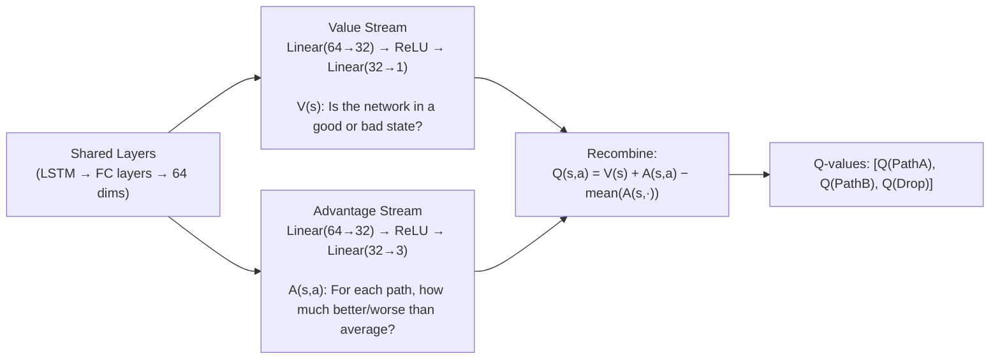

# Dueling DQN
### Separating "How Good is This State?" from "Which Action is Best?"

---

## Table of Contents

- [[#1. Intuition|1. Intuition]]
- [[#2. Technical Explanation|2. Technical Explanation]]
- [[#3. Mathematical / Algorithmic Details|3. Mathematical / Algorithmic Details]]
- [[#4. Role in Our Project|4. Role in Our Project]]
- [[#5. Interconnections|5. Interconnections]]
- [[#6. Advanced Insights|6. Advanced Insights]]
- [[#7. References for Further Study|7. References for Further Study]]

---

## 1. Intuition

Imagine you're a chess grandmaster. When you look at a board position, you immediately form two separate judgments:

1. **"How good is this position for me overall?"** — Are my pieces well-placed? Am I winning or losing? This is the **state value**.
2. **"Which specific move is best?"** — Given how good the position is, what's the best action I can take? This is the **action advantage**.

A beginner can't separate these. They just look at each possible move and say "this move feels like 7/10, this one feels like 4/10." They're confusing "the position is good" with "this move is good."

An expert naturally separates them: "I'm in a strong position (8/10). Between three possible moves, this knight move is my best option (+2 advantage over average). The bishop move is average (0). The rook move is slightly worse (−2)."

**Dueling DQN gives the AI this expert-level separation.**

It splits its output into two streams:
- **Value stream V(s):** "How good is the network right now, regardless of which path I pick?"
- **Advantage stream A(s, a):** "Relative to average, how much better or worse is each specific path choice?"

These streams are then **recombined** to produce the final Q-values. The result: the AI can learn "the network is in crisis" (V is low) separately from "in this crisis, Path B is the best option" (A is high for Path B) — and these two pieces of knowledge reinforce rather than interfere with each other.

---

## 2. Technical Explanation

### The Problem with Plain DQN's Output Layer

In a plain [[DQN_Model]], the output layer directly produces 3 Q-values:
```
[Q(s, PathA), Q(s, PathB), Q(s, Drop)]
```

When the network is empty (all paths are fine), all three Q-values should be high and approximately equal. The model needs to simultaneously represent:
1. "This is a good state" (all values high)
2. "No action stands out" (all values similar)

Both pieces of information are crammed into the same 3 numbers. When a training update changes `Q(s, PathA)`, it also subtly distorts the representation of how good the state is overall — which then contaminates the estimates for PathB and Drop. Updates to one action **interfere** with learning about others.

### The Dueling Solution

Dueling DQN **splits the final layers** of the network into two parallel streams before recombining:



**Only the architecture changes.** The input (state sequence), output (Q-values), and training procedure are otherwise identical to plain DQN.

### The Recombination Formula

```
Q(s, a) = V(s) + A(s, a) − mean_a'(A(s, a'))
```

**Why subtract the mean?** Without this term, V(s) and A(s,a) are **unidentifiable** — you could add any constant to V and subtract it from all A values and get the same Q-values. The subtraction of the mean forces the Advantage values to sum to exactly zero across all actions, making the decomposition unique: V(s) is unambiguously the "average value of being in state s" and A(s,a) is unambiguously the "deviation from that average for action a."

---

## 3. Mathematical / Algorithmic Details

### Formal Definitions

**State Value Function:**
```
V^π(s) = E_π[G_t | S_t = s]
       = Expected cumulative discounted reward from state s following policy π
```

**Action-Value (Q) Function:**
```
Q^π(s, a) = E_π[G_t | S_t = s, A_t = a]
           = Expected cumulative discounted reward from state s, taking action a first
```

**Advantage Function:**
```
A^π(s, a) = Q^π(s, a) − V^π(s)
           = How much better is action a compared to the average action in state s?
```

By definition: `mean_a A^π(s, a) = 0` (since V is the average Q).

### The Training Loss

Identical to plain DQN — the Bellman MSE loss applies to the recombined Q-values:

```
L(θ) = E[(r + γ × max_a' Q_target(s', a'; θ⁻) − Q_online(s, a; θ))²]
```

The gradients flow backward through the Q recombination formula, then diverge into both the Value stream and the Advantage stream. Both streams update simultaneously on every training step.

### Concrete Example

State: Path A busy (link1_util = 0.9), Path B idle (link1_util = 0.2), LSTM detects persistent congestion.

After training:
```
V(s) = 0.45                            # Network is in a moderately poor state (congestion)
A(s, PathA)  = −0.55                   # Path A is much worse than average
A(s, PathB)  = +0.49                   # Path B is much better than average
A(s, Drop)   = +0.06                   # Dropping is slightly above average (last resort)
mean(A) = (−0.55 + 0.49 + 0.06) / 3 = 0.00

Q(PathA) = 0.45 + (−0.55 − 0.00) = −0.10
Q(PathB) = 0.45 + (0.49 − 0.00)  = 0.94    ← chosen
Q(Drop)  = 0.45 + (0.06 − 0.00)  = 0.51
```

The AI correctly routes to Path B. Notice how V=0.45 (moderate state) cleanly separates from the action-specific advantages — they can each be updated independently without the other getting contaminated.

---

## 4. Role in Our Project

Dueling DQN addresses **Blindspot 4** from the basic model: when all paths are approximately equal (which is most of the time on a lightly loaded network), the plain DQN struggles to learn meaningful differences between actions — its three Q-values end up similar and noisy.

In our project, the network is often in a "quiet" state where all three paths perform reasonably well. The Dueling architecture learns V(s) quickly (all three actions lead to decent outcomes → V ≈ high) while simultaneously learning the small Advantage differences. These two learning tasks don't fight each other.

**Where the improvement is most visible in our experiments:**
- **Uniform traffic scenario:** All three policies perform similarly. Dueling DQN correctly learns high V(s) and near-zero Advantage differences — it doesn't confuse "I don't know which is better" with "they're all bad."
- **Adversarial scenario:** When the elephant flow arrives and Path A saturates, V(s) drops sharply (bad state) while A(PathB) spikes (Path B is dramatically better). The Dueling architecture updates both signals cleanly and simultaneously.

---

## 5. Interconnections

- [[DQN_Model]] — Dueling DQN is an architectural variant of the base DQN; it replaces the plain output layer
- [[LSTM_Memory]] — feeds its 128-dim hidden state into the shared layers that precede the Dueling split
- [[State_Space]] — the richer 20-feature state makes the Value/Advantage decomposition more meaningful (V(s) can better represent state quality when state is rich)
- [[Training_Process]] — training procedure is unchanged; the improvement is purely architectural
- [[Reward_Function]] — a richer reward makes it easier for V(s) to learn meaningful state quality differences

---

## 6. Advanced Insights

### When Dueling Architecture Helps Most

The Advantage of Dueling DQN is proportional to the **frequency of states where all actions are approximately equally good.** In those states, the plain DQN must simultaneously update all Q-values and keep them consistent. Dueling separates these concerns.

In network routing:
- During quiet periods (normal load): Dueling learns V(s) quickly. Actions are similar; Advantage stream stays near zero.
- During congested periods: Dueling learns large Advantage differences quickly since V is already well-learned.

The result: Dueling DQN converges faster and with lower variance than plain DQN, especially in the common "quiet network" regime.

### Dueling + Double DQN

Our model uses **both** Dueling architecture **and** Double DQN training. These are independent improvements that combine:

- **Double DQN** reduces overestimation by decoupling action selection (online network) from evaluation (target network)
- **Dueling architecture** separates state value from action advantage for cleaner learning

Together, they address the two main failure modes of plain DQN: overestimation bias and entangled value/advantage learning.

### Alternative Decompositions

The max-based alternative to mean-based centering:
```
Q(s, a) = V(s) + A(s, a) − max_a'(A(s, a'))
```

This ensures the best action has advantage zero, and all others are non-positive. It's less commonly used because it introduces gradient discontinuities at the argmax. Mean-based centering is smoother and trains more stably.

---

## 7. References for Further Study

- **Original Dueling DQN** — Wang et al., "Dueling Network Architectures for Deep Reinforcement Learning" (2016)
- **Why the baseline subtraction matters** — Greensmith et al., "Variance Reduction Techniques for Gradient Estimates in RL" (2004) — theoretical basis for control variates
- **Advantage estimation** — Schulman et al., "High-Dimensional Continuous Control Using Generalized Advantage Estimation" (2016) — GAE for actor-critic methods
- **Topics to explore:** Actor-Critic architectures (explicitly separate value and policy networks), A3C/A2C (Asynchronous Advantage Actor-Critic), PPO (Proximal Policy Optimization) which also leverages advantage estimates
