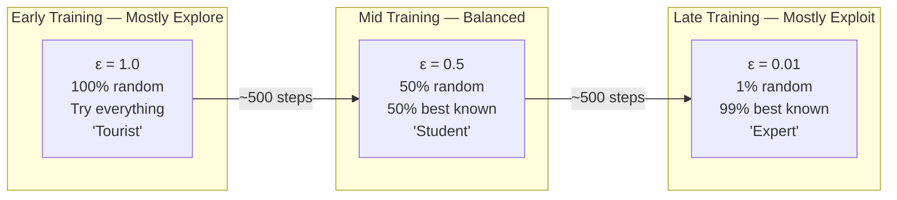

# Exploration vs Exploitation
### The Fundamental Tension in Learning

---

## Table of Contents

- [[#1. Intuition|1. Intuition]]
- [[#2. Technical Explanation|2. Technical Explanation]]
- [[#3. Mathematical / Algorithmic Details|3. Mathematical / Algorithmic Details]]
- [[#4. Role in Our Project|4. Role in Our Project]]
- [[#5. Interconnections|5. Interconnections]]
- [[#6. Advanced Insights|6. Advanced Insights]]
- [[#7. References for Further Study|7. References for Further Study]]

---

## 1. Intuition

You just moved to a new city. You're hungry. You have two options:

**Exploitation:** Go back to the one restaurant you already know is decent. You're confident you'll get a good meal. No surprises.

**Exploration:** Try the new ramen place you haven't visited. It might be incredible. It might be terrible. You won't know until you try.

If you always exploit (always return to the known restaurant), you'll never discover the amazing ramen place three blocks away. But if you always explore (try a new restaurant every night), you'll spend years eating terrible food while occasionally hitting something good.

**The optimal strategy is a mix:** Explore heavily when you know little. Exploit more as you build knowledge. Never completely stop exploring — the city changes, new restaurants open.

**Our AI faces the exact same dilemma, every single routing decision:**

- **Exploration:** Pick a random path — might be bad, but generates learning data about situations the AI hasn't tried
- **Exploitation:** Pick the path the AI believes is best given its current knowledge — higher expected performance, but no new learning

Too much exploitation early → AI gets stuck in a local optimum, never discovers better strategies.
Too much exploration late → AI keeps making random routing choices even after it knows the right answer.

---

## 2. Technical Explanation

### ε-Greedy Strategy

The standard solution in Q-learning is **epsilon-greedy (ε-greedy)**:

```python
def select_action(self, state):
    if random.random() < self.epsilon:
        # EXPLORE: pick uniformly at random from all actions
        return random.randint(0, self.action_size - 1)
    else:
        # EXPLOIT: pick the action with the highest Q-value
        with torch.no_grad():
            q_values = self.q_network(state)
        return q_values.argmax().item()
```

- With probability `ε`: random action (any path equally likely)
- With probability `1 - ε`: greedy action (argmax Q)

### Epsilon Decay Schedule

ε starts at 1.0 (completely random) and is multiplied by a decay factor every step until it reaches the minimum:

```python
self.epsilon = max(self.epsilon * self.epsilon_decay, self.epsilon_min)
# With epsilon_decay=0.995, epsilon_min=0.01:
# Step 0:    ε = 1.000
# Step 100:  ε = 0.606
# Step 300:  ε = 0.223
# Step 500:  ε = 0.082
# Step 692:  ε = 0.030
# Step 918:  ε = 0.010  ← minimum reached
```



### Why ε Never Reaches Zero

Even at full exploitation (ε=0.01), 1% of actions are still random. This is intentional:

1. **Network non-stationarity:** Traffic patterns change. A strategy optimal today may be suboptimal next month. Keeping ε>0 means the AI keeps sampling the environment and can discover that conditions have changed.
2. **Unvisited states:** Some network conditions may be extremely rare in training. Keeping ε>0 ensures they can still be discovered.
3. **Catastrophic overfitting:** ε=0 can cause the policy to degenerate into a deterministic but locally optimal strategy with no ability to adapt.

---

## 3. Mathematical / Algorithmic Details

### The Exploration-Exploitation Dilemma Formalized

In the Multi-Armed Bandit (MAB) problem — the simplest version of the exploration-exploitation dilemma — the agent must choose between K arms (actions), each with an unknown reward distribution. The goal is to maximize cumulative reward over T timesteps.

The **optimal strategy** (in terms of expected regret — difference from always picking the best arm) is to **explore proportionally to uncertainty**. Known algorithms:

| Algorithm | Exploration Mechanism | Regret |
|---|---|---|
| ε-greedy | Fixed ε fraction random | O(T) in worst case |
| UCB (Upper Confidence Bound) | Explore actions with high uncertainty | O(log T) |
| Thompson Sampling | Sample from posterior over reward distributions | O(log T) |
| Boltzmann (Softmax) | Sample proportional to exp(Q/τ) | Depends on τ schedule |

**Why we use ε-greedy despite its suboptimality:**

- Simplest to implement
- Well-understood in practice
- Compatible with deep function approximation (neural networks)
- Works reliably with appropriate decay

UCB and Thompson Sampling require maintaining uncertainty estimates over Q-values — tractable for simple tabular Q-learning, but complex for neural network Q-functions.

### The Decay Formula

With decay rate `d` and minimum `ε_min`:

```
ε_t = max(ε_0 × d^t, ε_min)

Number of steps to reach ε_min from ε_0:
t* = log(ε_min / ε_0) / log(d)
   = log(0.01 / 1.0) / log(0.995)
   = (−4.605) / (−0.005012)
   ≈ 918 steps
```

With approximately 2–3 episodes per training step (some steps have multiple flow routing decisions), 918 steps ≈ ~1,800–2,700 episodes. Early learning from exploration continues until that point.

### Boltzmann Exploration (Alternative)

Instead of ε-greedy, the Boltzmann (softmax) policy selects action with probability proportional to its Q-value:

```
P(a | s) = exp(Q(s, a) / τ) / Σ_{a'} exp(Q(s, a') / τ)
```

Where τ (temperature) is annealed over time. At high τ, actions are nearly equally likely (exploration). At low τ, the action with the highest Q dominates (exploitation).

Advantage: exploration is **proportional to confidence** — actions with slightly lower Q have a small but nonzero chance. This is smoother than ε-greedy's binary random/greedy switch.
Disadvantage: Q-values must be on a comparable scale for temperature tuning to be meaningful. LSTM-based Dueling networks can produce Q-values with difficult-to-predict scales.

---

## 4. Role in Our Project

Exploration generates the **diverse training data** that the [[Replay_Buffer]] stores and the [[Training_Process]] uses to improve the model. Without sufficient exploration:

- The AI might never try routing camera flows to Path B (if Path A always looked OK at the start)
- The AI might never experience the full effect of an elephant flow on Path A (if it always avoided it by chance)
- The AI might never discover that priority flows are treated differently (if it happened to route them well by luck)

**In our training setup:**

During the first 300 episodes (ε≈0.8), the AI tries every combination roughly equally — both paths for every traffic type in every congestion scenario. This builds a rich training dataset that the LSTM can learn temporal patterns from.

During episodes 500–1000 (ε≈0.4), the AI is starting to show learned preferences but still deviates from them 40% of the time. Each deviation that performs worse reinforces the learned preference; each deviation that surprisingly performs better updates the policy.

During episodes 2000+ (ε≈0.02), the AI is essentially in expert mode with 2% random noise. In our demo, this is the operating mode — predominantly expert routing with occasional random decisions that serve as ongoing calibration.

---

## 5. Interconnections

- [[DQN_Model]] — ε-greedy is implemented inside the `select_action()` method of the DQN agent
- [[Training_Process]] — the full training loop shows exactly where ε-greedy is called and how ε is decayed per step
- [[Replay_Buffer]] — exploration decisions generate the diverse experiences stored in the buffer; exploitation decisions generate the "confident" experiences; both are necessary
- [[Reward_Function]] — the reward signal provides feedback on both exploratory (random) and exploitative (greedy) actions; without reward, exploration generates no learning signal
- [[State_Space]] — exploration ensures the model sees many different states; without exploration, some state regions might never be visited

---

## 6. Advanced Insights

### Exploration in Non-Stationary Environments

Our network is approximately stationary during training (fixed Mininet topology, fixed traffic generators). But in production deployment, the network IS non-stationary — new devices are added, traffic patterns change seasonally, link upgrades happen.

With ε=0.01 in production, the AI explores 1% of the time. If network conditions drift significantly, 1% exploration may not be enough to detect the drift and update the policy.

**Adaptive ε:** If the rolling average reward drops below a threshold (suggesting the policy is no longer optimal), automatically increase ε temporarily to re-explore the environment.

```python
if rolling_avg_reward < performance_threshold:
    self.epsilon = min(self.epsilon * 1.1, 0.5)   # Emergency re-exploration
else:
    self.epsilon = max(self.epsilon * 0.9995, 0.01)  # Normal decay
```

### The Exploration Phase and First-Packet Latency

During exploration (ε=1.0), 100% of routing decisions are random. This means:
- Sometimes the sensor flow is accidentally routed to the congested Path A (when Path B is clearly better)
- The flow experiences high latency, drops packets, and receives a large negative reward
- This negative experience is stored in the buffer and trains the model to **never** make that mistake again when the congested state is recognized

Counterintuitive but true: the AI learns more from its exploration **mistakes** than from its successes. The negative reward signal from bad exploration decisions is often more informative than the positive signal from lucky good decisions.

### Optimistic Initial Values

An alternative to ε-greedy exploration: initialize all Q-values to a high value (e.g., +5.0) instead of 0. Then use pure exploitation (ε=0).

When the agent first tries an action, the actual Q value (from the Bellman update) will likely be lower than the initial +5.0 — so the agent "learns it wasn't as good as expected." For unexplored actions, Q remains at +5.0, so the agent is naturally drawn to try them next.

This "optimistic initialization" guarantees every action is tried at least once without explicit randomness — but can be unstable with neural networks where weights are updated continuously.

---

## 7. References for Further Study

- **Multi-Armed Bandit problem** — Auer et al., "Finite-time Analysis of the Multiarmed Bandit Problem" (2002) — UCB algorithm
- **Thompson Sampling** — Thompson, "On the Likelihood that One Unknown Probability Exceeds Another" (1933) — foundational Bayesian exploration
- **Exploration in deep RL** — Bellemare et al., "Unifying Count-Based Exploration and Intrinsic Motivation" (2016) — count-based exploration for complex state spaces
- **Intrinsic motivation** — Pathak et al., "Curiosity-driven Exploration by Self-Supervised Prediction" (2017) — explore based on prediction error
- **Topics to explore:** NoisyNets (add learnable noise to network weights as implicit exploration), Posterior sampling, Bootstrapped DQN (maintain ensemble of Q-networks for uncertainty estimation), Information-theoretic exploration
