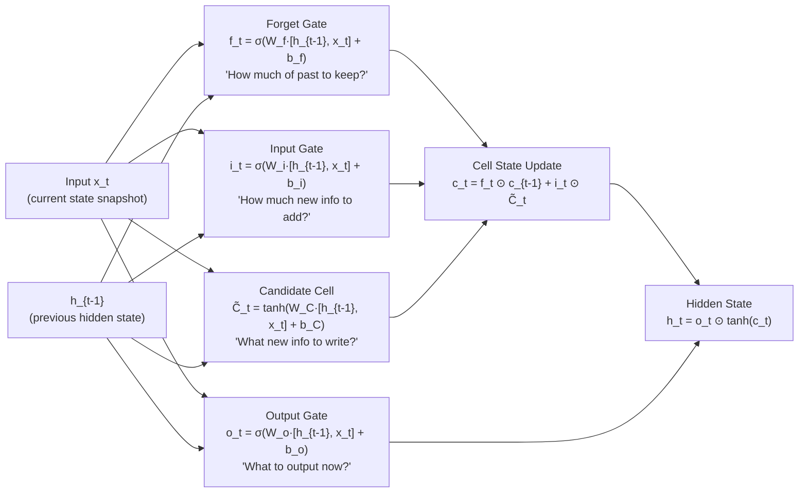

# LSTM Memory
### Long Short-Term Memory — Giving the AI a History

---

## Table of Contents

- [[#1. Intuition|1. Intuition]]
- [[#2. Technical Explanation|2. Technical Explanation]]
- [[#3. Mathematical / Algorithmic Details|3. Mathematical / Algorithmic Details]]
- [[#4. Role in Our Project|4. Role in Our Project]]
- [[#5. Interconnections|5. Interconnections]]
- [[#6. Advanced Insights|6. Advanced Insights]]
- [[#7. References for Further Study|7. References for Further Study]]

---

## 1. Intuition

Imagine two doctors walking into an emergency room. Both observe the exact same patient right now — same vitals, same test results. But one doctor also has the patient's chart from the past hour showing: blood pressure rising steadily, oxygen saturation slowly falling, heart rate accelerating.

The second doctor knows something the first cannot: **the patient is deteriorating**. Even if the current snapshot looks non-critical, the trend says otherwise. The right action is to escalate treatment immediately.

**LSTM gives the AI the equivalent of that patient chart.**

Without LSTM, the AI sees a single snapshot of the network — what utilization, queue depth, and jitter look like *right now*. Two completely different network situations can produce identical snapshots:

- **Situation A:** Link has been at 85% utilization for 30 minutes with 40 established flows. Congestion is permanent.
- **Situation B:** Link jumped to 85% 2 seconds ago from a single burst. It will probably drop back to 20% in 5 seconds.

A single-snapshot AI cannot distinguish these. **It would make the same routing decision for both**, even though the optimal responses are opposite.

LSTM solves this by processing the last 10 snapshots (the last 20 seconds) as a sequence. It builds a running "memory" of what has been happening, which informs every new decision.

---

## 2. Technical Explanation

### What is a Recurrent Neural Network (RNN)?

A standard neural network processes each input independently — no connection between inputs. An RNN processes inputs **sequentially**, passing a hidden state from one step to the next. This hidden state is the "memory" — it carries information forward from earlier inputs.

```
Standard NN:    input_1 → output_1
                input_2 → output_2     (no connection between steps)

RNN:            input_1 → hidden_1 → output_1
                            ↓
                input_2 → hidden_2 → output_2     (hidden state carries memory)
```

### The Problem with Basic RNNs

Standard RNNs can carry memory, but when sequences get long, they suffer from the **vanishing gradient problem**: during backpropagation, the gradient signal from early timesteps gets multiplied together many times and shrinks to effectively zero. The network stops being able to learn patterns from the distant past.

**LSTM was designed specifically to solve this.** It uses a more complex gating mechanism to preserve important information over long sequences without gradient decay.

### The LSTM Architecture

An LSTM cell maintains **two pieces of state** at each timestep:

- **Cell state (`c_t`):** Long-term memory. Modified slowly through add and forget operations.
- **Hidden state (`h_t`):** Short-term working memory. Output of the LSTM at each step.

The LSTM uses four learnable "gates" to control information flow:



**The key innovation:** The forget gate can learn to completely preserve certain information for many timesteps (by setting `f_t ≈ 1`), or completely erase it (by setting `f_t ≈ 0`). The gradient flows through the cell state unimpeded by the forget gate — this is what prevents vanishing gradients in long sequences.

### In Our Model

The LSTM layer in our DQN receives:
- Input shape: `(batch, 10, 20)` — 10 timesteps, 20 features each
- Hidden size: 128
- Output: The final hidden state `h_10` of shape `(batch, 128)` — a 128-dimensional summary of the last 20 seconds of network behavior

This 128-dimensional vector then enters the shared fully-connected layers and eventually the [[Dueling_DQN|Dueling DQN heads]].

```python
class LSTMDuelingNetwork(nn.Module):
    def __init__(self, state_size=20, seq_len=10, lstm_hidden=128, action_size=3):
        super().__init__()
        # Temporal processing
        self.lstm = nn.LSTM(input_size=state_size,
                            hidden_size=lstm_hidden,
                            num_layers=1,
                            batch_first=True)
        # Shared representation
        self.shared = nn.Sequential(
            nn.Linear(lstm_hidden, 256), nn.BatchNorm1d(256), nn.ReLU(), nn.Dropout(0.2),
            nn.Linear(256, 128),         nn.BatchNorm1d(128), nn.ReLU(), nn.Dropout(0.2),
            nn.Linear(128, 64),          nn.ReLU()
        )
        # Dueling heads
        self.value_stream = nn.Sequential(nn.Linear(64,32), nn.ReLU(), nn.Linear(32,1))
        self.adv_stream   = nn.Sequential(nn.Linear(64,32), nn.ReLU(), nn.Linear(32, action_size))

    def forward(self, x):  # x: (batch, 10, 20)
        lstm_out, _ = self.lstm(x)         # (batch, 10, 128)
        h = lstm_out[:, -1, :]             # Take last timestep: (batch, 128)
        h = self.shared(h)                 # (batch, 64)
        V = self.value_stream(h)           # (batch, 1)
        A = self.adv_stream(h)             # (batch, 3)
        Q = V + (A - A.mean(dim=1, keepdim=True))  # (batch, 3)
        return Q
```

---

## 3. Mathematical / Algorithmic Details

### Gate Equations

At each timestep t, given input `x_t` and previous hidden state `h_{t-1}`:

**Forget Gate:** Decides what to erase from cell state
```
f_t = σ(W_f · [h_{t-1}, x_t] + b_f)      f_t ∈ (0,1) per cell
```

**Input Gate:** Decides what new information to write
```
i_t = σ(W_i · [h_{t-1}, x_t] + b_i)
C̃_t = tanh(W_C · [h_{t-1}, x_t] + b_C)   candidate values
```

**Cell State Update:** Old memory (scaled by forget) + new info (scaled by input gate)
```
c_t = f_t ⊙ c_{t-1} + i_t ⊙ C̃_t
```

**Output Gate:** Decides what to expose as the hidden state
```
o_t = σ(W_o · [h_{t-1}, x_t] + b_o)
h_t = o_t ⊙ tanh(c_t)
```

Where `σ` = sigmoid, `⊙` = element-wise multiplication, `tanh` = hyperbolic tangent.

### Why tanh and σ?

- **Sigmoid (σ):** Output in (0,1) — perfect for gates (0 = close, 1 = open)
- **tanh:** Output in (−1,1) — zero-centered, good for information that can be positive or negative (congestion going up or down)

### Sequence Window Design Choices

| Parameter | Our Value | Tradeoff |
|---|---|---|
| Window length | 10 steps | Shorter = less memory; Longer = more compute, harder to train |
| Poll interval | 2 seconds | Shorter = finer resolution; Longer = misses fast transients |
| Total history | 20 seconds | Captures: elephant flow detection, burst vs sustained congestion |
| LSTM hidden size | 128 | Larger = more expressive; Smaller = faster, less overfit |

### Parameter Count

For our LSTM with input=20, hidden=128:
- Each gate has weight matrix `W` of shape `(128, 20+128)` = `(128, 148)` and bias of shape `(128,)`
- 4 gates × (128×148 + 128) = 4 × (18,944 + 128) = **76,288 parameters** in the LSTM alone

---

## 4. Role in Our Project

The LSTM is the **temporal intelligence** layer. It is the component that lets the AI reason about *trends* and *persistence* — not just snapshots.

**Specific patterns the LSTM learns to detect:**

| Pattern | LSTM recognition | AI response |
|---|---|---|
| Rising congestion (steady increase over 8 steps) | Cell state accumulates rising signal | Pre-emptively route new flows to Path B |
| Burst (sudden spike in 1 step) | Forget gate quickly resets | Wait conservatively before rerouting |
| Periodic daily pattern (same time each day) | Cell state encodes recurring sequence | Pre-route away from historically congested paths at certain hours |
| Elephant flow lifecycle (bytes growing each step) | Cell state tracks accumulating flow_bytes_so_far | Route around it; flag it as long-running |
| Path recovery (utilization falling after congestion) | Forget gate removes the congestion signal | Gradually allow flows back to Path A |

None of these patterns are explicitly programmed. They emerge from training on traffic data.

**The LSTM replaces several explicit rules** that a traditional network engineer would hardcode (e.g., "if Path A has been above 80% for 10 seconds, reroute"). The AI discovers the equivalent of these rules automatically from the reward signal.

---

## 5. Interconnections

- [[DQN_Model]] — the LSTM is the front-end temporal encoder for the full DQN architecture
- [[Dueling_DQN]] — receives the LSTM's 128-dimensional hidden state as input
- [[State_Space]] — the 20 features that form each timestep in the LSTM's input sequence
- [[Feature_Engineering]] — builds the raw data fed into the sequence buffer
- [[Training_Process]] — explains how sequence tuples are stored in the Replay Buffer and used during training
- [[Replay_Buffer]] — each stored experience now contains a full `(10, 20)` sequence, not just a single snapshot

---

## 6. Advanced Insights

### Training Instability with LSTM

LSTM models are susceptible to **gradient explosion** — when backpropagating through 10 timesteps, gradients can grow exponentially large, causing weights to update in catastrophically large steps.

**Fix: Gradient clipping**
```python
torch.nn.utils.clip_grad_norm_(model.parameters(), max_norm=1.0)
```
This caps the global gradient norm, preventing individual batches from destabilizing the entire model.

**Hidden state saturation:** If the cell state values drift to very large magnitudes, the tanh output saturates at ±1 and gradients vanish completely. Initialization matters: cell state initialized to zeros, hidden state to zeros. Batch Normalization on intermediate layers helps prevent feature magnitudes from cascading.

### The Persistent Hidden State

Between routing decisions for the same switch context, the LSTM's hidden state is **not reset**. It persists across calls, accumulating a continuous memory of network history. This means the model's understanding of active flows evolves continuously — after a flow has been running for 60 seconds, the hidden state encodes its entire history, not just the last window.

However, this also means that if the network is restarted or the model re-initialized, the hidden state starts at zeros and the first few routing decisions are made with incomplete temporal context. A warm-up period (or loading a saved hidden state) can mitigate this.

### LSTM vs Transformer for This Task

Transformers have surpassed LSTMs in most NLP and time series tasks due to their attention mechanisms, which can focus on any part of the sequence. For routing decisions, the limited sequence length (10 steps) means the advantage of attention is smaller. LSTMs are also faster and cheaper for short sequences. If the window were extended to 100+ steps, a Transformer architecture would likely outperform the LSTM.

### When LSTM Helps Most — and Least

**LSTM helps most when:**
- Traffic patterns are temporal (daily cycles, flow lifecycles)
- Congestion onset and clearing have predictable durations
- Burst vs sustained congestion needs to be distinguished

**LSTM helps least when:**
- Network state changes faster than the polling interval (2s) can capture
- All congestion is completely random with no persistent structure
- The topology changes dynamically (LSTM has memorized patterns for a fixed topology)

---

## 7. References for Further Study

- **Original LSTM paper** — Hochreiter & Schmidhuber, "Long Short-Term Memory" (1997)
- **Understanding LSTMs** — Olah, "Understanding LSTM Networks" (2015) — highly recommended visual explanation
- **Vanishing gradient problem** — Bengio et al., "Learning Long-Term Dependencies with Gradient Descent is Difficult" (1994)
- **GRU (Gated Recurrent Unit)** — A simpler alternative to LSTM with fewer parameters; often comparable performance
- **Transformer for time series** — "Attention Is All You Need" (Vaswani et al., 2017); later works applying it to sequential decision making
- **Topics to explore:** Bidirectional LSTM (processes sequence in both directions), Stacked LSTM (deeper temporal processing), Temporal Convolutional Networks (TCN) as alternative sequence model, Sequence-to-sequence architectures for multi-step prediction
