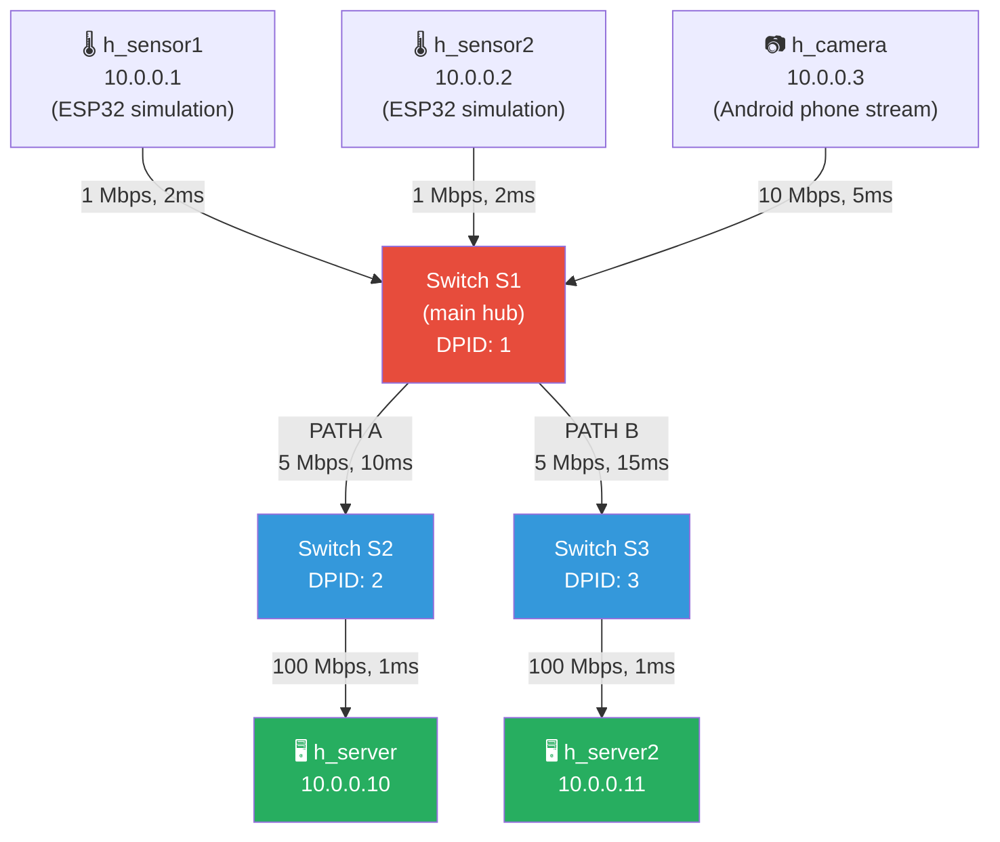

# Network Topology
### The Physical Layout — Switches, Links, and Paths

---

## Table of Contents

- [[#1. Intuition|1. Intuition]]
- [[#2. Technical Explanation|2. Technical Explanation]]
- [[#3. Mathematical / Algorithmic Details|3. Mathematical / Algorithmic Details]]
- [[#4. Role in Our Project|4. Role in Our Project]]
- [[#5. Interconnections|5. Interconnections]]
- [[#6. Advanced Insights|6. Advanced Insights]]
- [[#7. References for Further Study|7. References for Further Study]]

---

## 1. Intuition

Think of the network topology as a road map. The switches are intersections, the links are roads, and the IoT devices are buildings.

In a city with only **one road between downtown and the hospital**, there's no way to reroute traffic — everyone is stuck on the same road. But if you build **two roads** (maybe one highway and one side street), suddenly you have choices. You can send emergency vehicles on the highway and construction trucks on the side street.

**Our network is designed with exactly two paths from the IoT devices to the servers.** This is a deliberate architectural choice — without two paths, there's nothing for the AI to optimize. With two paths, the AI can actively direct different types of traffic to different routes based on congestion.

---

## 2. Technical Explanation

### The Topology Structure



### Component Table

| Component | IP / Role | Link Speed | Delay | Purpose |
|---|---|---|---|---|
| h_sensor1 | 10.0.0.1 | 1 Mbps | 2ms | Simulates ESP32 temperature sensor |
| h_sensor2 | 10.0.0.2 | 1 Mbps | 2ms | Second ESP32 sensor (redundancy test) |
| h_camera | 10.0.0.3 | 10 Mbps | 5ms | Android phone video stream |
| Switch S1 | DPID 1 | — | — | Main aggregation hub for all IoT devices |
| Switch S2 | DPID 2 | — | — | Path A intermediate switch |
| Switch S3 | DPID 3 | — | — | Path B intermediate switch |
| h_server | 10.0.0.10 | 100 Mbps | 1ms | Primary data collection server |
| h_server2 | 10.0.0.11 | 100 Mbps | 1ms | Secondary server (Path B endpoint) |

### The Two Paths

| | Path A | Path B |
|---|---|---|
| Route | S1 → S2 → h_server | S1 → S3 → h_server2 |
| Bandwidth | 5 Mbps | 5 Mbps |
| Propagation delay | 10ms | 15ms |
| Total RTT (sensor→server) | ~24ms (2+10+1+1+10) | ~29ms (2+15+1+1+10) |
| OvS switch port | port 2 | port 3 |

**Key design decision:** Both paths have identical 5 Mbps capacity. Path A has lower base delay (10ms vs 15ms). This means:

- In quiet conditions, Path A is marginally better — the AI should prefer it slightly.
- When Path A becomes congested (elephant flow), Path B becomes dramatically better despite its +5ms base delay — the AI should aggressively reroute.
- The performance gap between the two paths becomes a clear test of the AI's intelligence.

### Mininet Implementation

```python
class IoTTopology(Topo):
    def build(self):
        # Switches
        s1 = self.addSwitch('s1')
        s2 = self.addSwitch('s2')
        s3 = self.addSwitch('s3')

        # IoT hosts
        sensor1 = self.addHost('h_sensor1', ip='10.0.0.1/24')
        sensor2 = self.addHost('h_sensor2', ip='10.0.0.2/24')
        camera  = self.addHost('h_camera',  ip='10.0.0.3/24')
        server  = self.addHost('h_server',  ip='10.0.0.10/24')
        server2 = self.addHost('h_server2', ip='10.0.0.11/24')

        # IoT device links (with bandwidth and delay constraints)
        self.addLink(sensor1, s1, bw=1,   delay='2ms')
        self.addLink(sensor2, s1, bw=1,   delay='2ms')
        self.addLink(camera,  s1, bw=10,  delay='5ms')

        # Dual-path backbone (core of the experiment)
        self.addLink(s1, s2, bw=5,  delay='10ms')   # Path A
        self.addLink(s1, s3, bw=5,  delay='15ms')   # Path B

        # Server uplinks (fast, not the bottleneck)
        self.addLink(s2, server,  bw=100, delay='1ms')
        self.addLink(s3, server2, bw=100, delay='1ms')
```

---

## 3. Mathematical / Algorithmic Details

### Why the 5 Mbps Bottleneck Is Chosen

IoT networks typically have constrained backbone bandwidth. 5 Mbps creates realistic congestion scenarios:

- A single elephant flow (TCP, max throughput) fills the link to ~4.8 Mbps
- Camera video at 3 Mbps uses 60% of the path — leaves only 40% for other flows
- Multiple sensors at 0.01 Mbps have negligible impact individually

This means:
- **Uniform traffic:** Well within 5 Mbps → no congestion → AI and ECMP perform similarly
- **Elephant flow:** 4.8 Mbps on a 5 Mbps link → 96% utilization → all other flows suffer
- **Adversarial:** Video (3 Mbps) + elephant (4.8 Mbps) > 5 Mbps → guaranteed overload

### End-to-End Delay Calculation

For a sensor packet on Path A:
```
delay = link_sensor1_to_S1 (2ms)
      + switch_S1_processing (~0.1ms, OpenFlow lookup)
      + link_S1_to_S2 (10ms)
      + switch_S2_processing (~0.1ms)
      + link_S2_to_server (1ms)
      = 13.2ms propagation + queuing delay

If Path A is 90% utilized (queue is filling):
    + queuing_delay = queue_depth × packet_size / link_rate
    = (e.g.) 50 packets × 1400 bytes × 8 / 5,000,000
    = 112ms additional queuing delay
Total: ~125ms vs the expected 13ms → 9× degradation
```

This is the exact scenario the AI must detect and respond to.

### The Congestion Collapse Threshold

At >80% link utilization, packet queues begin filling. At >95%, packets are dropped. Our experiments deliberately push into this zone with elephant flows to demonstrate the performance advantage of AI routing.

---

## 4. Role in Our Project

The network topology is the **stage on which everything else happens.** 

**Why this exact design:**

- **Three IoT nodes (2 sensors + 1 camera):** Provides diversity — different traffic types with different requirements, all sharing the same uplink switch (S1).
- **Dual paths from S1 to servers:** This is the entire point. Without two paths, there is no routing decision to make. With exactly one alternative path, the decision is binary (A or B) — simple enough for the DQN's 3-action space (PathA, PathB, Drop).
- **Equal capacity, different delay:** Ensures the "correct" answer isn't always the same path — it depends on current load, traffic type, and priorities. This is the minimum complexity needed for interesting AI behavior.
- **100 Mbps server uplinks:** Removes the server as a bottleneck — all congestion happens at the 5 Mbps backbone links, where the AI's routing decisions have clear cause-and-effect.
- **Mininet emulation:** Lets us run controlled experiments on a laptop. All experiments (9 combinations of routing policy × traffic scenario) are reproducible.

---

## 5. Interconnections

- [[SDN_Controller]] — the Ryu controller builds a graph of this topology using LLDP discovery and maintains it in a NetworkX `DiGraph`
- [[Routing_Policies]] — each policy (Shortest Path, ECMP, AI) navigates this topology's graph to make routing decisions
- [[OpenFlow_Protocol]] — FlowMod messages reference specific **port numbers** on specific **switch DPIDs** from this topology
- [[State_Space]] — `link1_util`, `link2_util`, `link3_util` map to specific links in this topology (S1→S2 and S1→S3 are the critical ones)
- [[IoT_Traffic_Types]] — the three hosts (sensor1, sensor2, camera) generate the three traffic types that stress this topology
- [[Feature_Engineering]] — OvS statistics are collected per-port, which maps to specific links in the topology

---

## 6. Advanced Insights

### Why Not More Switches?

This topology is intentionally minimal. More switches → larger action space → harder learning problem. Two paths with one bottleneck each is sufficient to demonstrate the AI's advantage over static policies.

In a real deployment, you would use a topology like:
- **Fat-tree:** 3-tier topology for data centers with many equal-cost paths
- **Spine-leaf:** Two-tier topology common in modern enterprise networks
- **Ring topology:** Common in industrial IoT for resilience

For each, the AI's approach generalizes — but training time and state complexity scale with the number of links.

### Upgrade Path: Dynamic Topology

The current topology is static — it never changes. Real networks have link failures, capacity upgrades, and device additions. To handle dynamic topology:

1. Ryu uses **LLDP (Link Layer Discovery Protocol)** to automatically detect link changes
2. The NetworkX graph is updated in real-time
3. The AI's state must include link failure flags
4. The AI must learn how to route around failures — which requires training on failure scenarios

This is a medium-complexity extension that dramatically increases the AI's real-world value.

### Two Servers vs One

Using two separate server endpoints (h_server on Path A, h_server2 on Path B) is a design simplification. In a real deployment, both paths might reach the same server through different IP routes. Our dual-server design makes the path selection explicit in the routing rules (different destination IPs for each path), which simplifies the FlowMod logic and makes the routing decisions visible in the flow table.

---

## 7. References for Further Study

- **Mininet documentation** — mininet.org — topology definition, link constraints, CLI reference
- **Open vSwitch documentation** — openvswitch.org — port statistics, flow table management
- **Fat-tree topology** — Al-Fares et al., "A Scalable, Commodity Data Center Network Architecture" (2008)
- **Network graph theory** — Dijkstra, "A Note on Two Problems in Connexion with Graphs" (1959) — foundational shortest-path algorithm
- **Topics to explore:** Segment routing for scalable path programming, Traffic engineering in provider networks (MPLS-TE), OSPF and BGP for large-scale topology awareness
