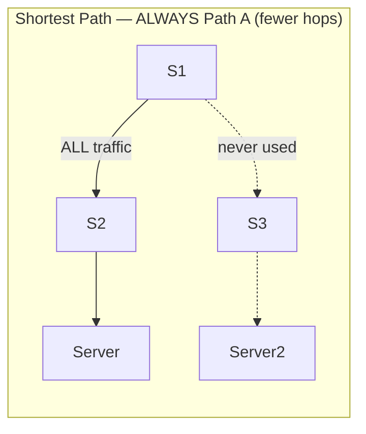
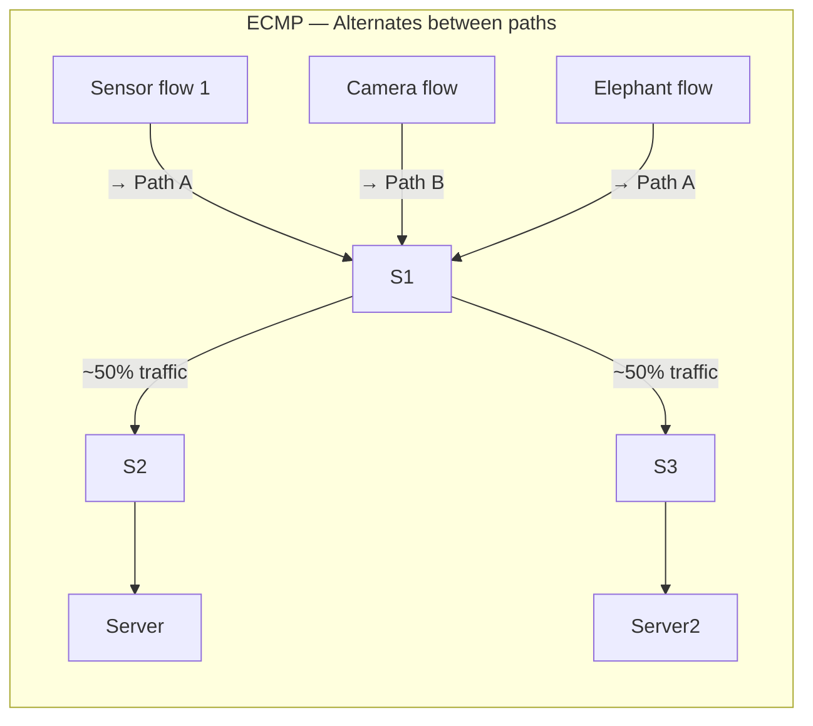
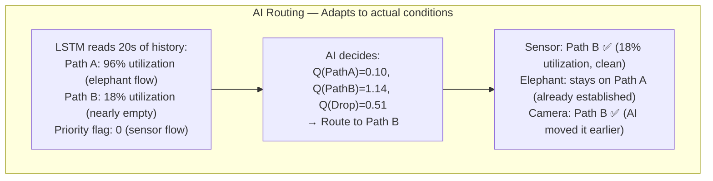

# Routing Policies
### Shortest Path vs ECMP vs AI — The Three Strategies Compared

---

## Table of Contents

- [[#1. Intuition|1. Intuition]]
- [[#2. Technical Explanation|2. Technical Explanation]]
- [[#3. Mathematical / Algorithmic Details|3. Mathematical / Algorithmic Details]]
- [[#4. Role in Our Project|4. Role in Our Project]]
- [[#5. Interconnections|5. Interconnections]]
- [[#6. Advanced Insights|6. Advanced Insights]]
- [[#7. References for Further Study|7. References for Further Study]]

---

## 1. Intuition

Imagine three taxi dispatchers, each running a different city:

**Dispatcher 1 — Shortest Path:** Every customer always takes the same route — the fastest road between their location and their destination. If that road is jammed, too bad. Every cab goes the same way.

**Dispatcher 2 — ECMP:** Takes turns. First customer goes Road A, second goes Road B, third goes Road A again. Mechanical round-robin. Better than always using one road, but still blind — doesn't check if Road A is jammed before sending someone there.

**Dispatcher 3 — AI Routing:** Checks actual traffic conditions before every decision. If Road A is jammed with a truck convoy, all important customers are sent to Road B. Normal deliveries stay on Road A. When the jam clears, the AI gradually shifts traffic back. It learns from experience which roads work best for which customer types at which times of day.

**Our project implements and compares all three dispatchers** to prove that Dispatcher 3 (the AI) wins when the network is under stress.

---

## 2. Technical Explanation

### Policy 1: Shortest Path Routing (Dijkstra)

**Algorithm:** Run Dijkstra's shortest path algorithm on the network topology graph using hop count as the weight. Always return the path with the fewest switches between source and destination.

```python
class ShortestPathRouter:
    def __init__(self, topology_graph):
        self.graph = topology_graph   # NetworkX DiGraph

    def get_path(self, src_dpid, dst_dpid, flow_info=None):
        # flow_info is IGNORED — this policy is traffic-blind
        try:
            path = nx.shortest_path(self.graph, src_dpid, dst_dpid, weight='hops')
            return path
        except nx.NetworkXNoPath:
            return None
```

**Behavior:**



**When it works:** Light load, uniform traffic, no congestion.
**When it fails:** Any scenario where the preferred path becomes saturated. There is no fallback — all traffic piles onto the same road regardless of load.

---

### Policy 2: ECMP — Equal Cost Multipath

**Algorithm:** Find all shortest paths (equal hop count). Assign flows to paths in a round-robin pattern using a global counter.

```python
class ECMPRouter:
    def __init__(self, topology_graph):
        self.graph = topology_graph
        self.flow_counter = 0

    def get_all_shortest_paths(self, src_dpid, dst_dpid):
        return list(nx.all_shortest_paths(self.graph, src_dpid, dst_dpid, weight='hops'))

    def get_path(self, src_dpid, dst_dpid, flow_info=None):
        paths = self.get_all_shortest_paths(src_dpid, dst_dpid)
        if not paths:
            return None
        selected = self.flow_counter % len(paths)
        self.flow_counter += 1
        return paths[selected]
```

**Behavior:**

Flow 1 → Path A, Flow 2 → Path B, Flow 3 → Path A, ...



**When it works:** Balanced, homogeneous traffic. If all flows are roughly the same size, round-robin does a decent job distributing load.

**When it fails:** When flows are heterogeneous (elephant + sensors). By bad luck, ECMP might send the elephant flow AND three sensor flows to Path A, while Path B is nearly empty. It has no awareness of flow sizes or priorities.

---

### Policy 3: AI / DQN Routing

**Algorithm:** Query the [[DQN_Model|DQN agent]] with the current [[State_Space|20-feature state vector]] (or 10-step sequence for LSTM). Agent returns the action (0=PathA, 1=PathB, 2=Drop) with the highest Q-value.

```python
class DQNRouter:
    def __init__(self, agent, state_collector):
        self.agent = agent
        self.state_collector = state_collector

    def get_path(self, src_dpid, dst_dpid, flow_info):
        state_sequence = self.state_collector.get_state_sequence()  # shape: (10, 20)
        action = self.agent.select_action(state_sequence)            # 0, 1, or 2
        return self._action_to_path(action, src_dpid, dst_dpid)

    def _action_to_path(self, action, src, dst):
        if action == 0:   return [src, 2, dst]   # Path A
        elif action == 1: return [src, 3, dst]   # Path B
        else:             return None             # Drop
```

**Behavior:**



**When it works:** Any congested scenario, mixed traffic types, presence of elephant flows, priority-sensitive flows.

**When it fails:** Novel traffic patterns not seen during training, topology changes, very rapid congestion onset (faster than LSTM window).

---

## 3. Mathematical / Algorithmic Details

### Dijkstra's Algorithm (Shortest Path)

Given a graph G with nodes as switch DPIDs and edges as links weighted by hop count (all = 1):

```
Input: G, source s, destination d
Output: path P = [s, n1, n2, ..., d]

Initialize: dist[s]=0, dist[all others]=∞
Priority queue: Q = {(0, s)}

While Q not empty:
    (dist_u, u) = Q.pop_min()
    If u == d: return reconstruct_path(u)
    For each neighbor v of u:
        alt = dist_u + weight(u, v)
        If alt < dist[v]:
            dist[v] = alt
            Q.push((alt, v))
```

For our 3-switch topology, Dijkstra always returns Path A (S1→S2) because it has the same hop count as Path B (S1→S3) but is explored first. Both are "shortest" (2 hops), but Dijkstra with arbitrary tiebreaking always picks one.

### ECMP Formal Definition

ECMP selects uniformly at random (or round-robin) among all paths with minimum weight:

```
ECMP_paths = {P : weight(P) = min over all paths}
selected = ECMP_paths[counter mod |ECMP_paths|]
```

For uniform random selection, the expected utilization on each path approaches 1/k of total load (k = number of equal paths). With round-robin, after n flows the exact utilization is perfect 50/50 for n even.

### DQN Routing as an MDP Policy

The DQN routing policy `π` maps state to action:

```
π(s) = argmax_a Q(s, a; θ)
```

Where θ are the learned neural network weights. This policy is deterministic (for the same state, always picks the same action) during inference (ε=0.01 at deployment). During training, it is stochastic (ε-greedy) to ensure exploration. See [[Exploration_vs_Exploitation]] for details.

---

## 4. Role in Our Project

The three routing policies are the **experimental variables** in our project. We compare them across three traffic scenarios (uniform, elephant, adversarial) to produce 9 data points across four metrics (latency, throughput, packet loss, fairness).

**Expected results:**

| Scenario | Shortest Path | ECMP | AI / DQN |
|---|---|---|---|
| **Uniform** (light load) | Good | Good | Good |
| **Elephant flow** | Poor (jam) | Moderate (lucky if elephant is split) | Excellent (routes around) |
| **Adversarial** (elephant + video + sensors) | Very Poor | Moderate | Excellent |

The AI advantage is **only visible under stress.** This is intentional — it proves the AI adds value exactly when routing decisions are hardest and matter most.

**Why compare all three?** A single demonstration of the AI performing well is not rigorous. Comparing against Shortest Path (the simplest baseline) and ECMP (a smarter baseline that uses both paths) isolates the AI's specific contribution: traffic-type awareness and temporal reasoning.

---

## 5. Interconnections

- [[DQN_Model]] — the implementation of the AI routing policy
- [[Network_Topology]] — the graph that Shortest Path and ECMP execute on; the port mappings that the AI's actions translate to
- [[SDN_Controller]] — the Ryu controller selects which policy to use based on a configuration flag; all three policies integrate through the same `get_path()` interface
- [[OpenFlow_Protocol]] — the policy's path decision is converted to FlowMod messages
- [[IoT_Traffic_Types]] — different traffic types expose the weaknesses of Shortest Path and ECMP but are handled correctly by AI
- [[Training_Process]] — the AI policy is the output of training; the other two policies require no training

---

## 6. Advanced Insights

### ECMP's Hash-Based Alternative

In real production routers, ECMP doesn't use round-robin — it uses **hash-based flow assignment**:

```
selected_path = hash(src_ip, dst_ip, src_port, dst_port, protocol) mod num_paths
```

This keeps each flow consistently on one path (avoiding reordering of packets within a flow) while distributing different flows across paths. Our round-robin implementation is simpler but conceptually equivalent for experiments.

### Why Shortest Path Always "Loses" in Our Topology

Our topology has exactly two equal-hop paths. Dijkstra with arbitrary tiebreaking always picks one — Path A. So Shortest Path in our experiment is equivalent to "always use Path A, no exceptions." This is the worst possible policy when Path A is congested. This extreme failure is intentional — it makes the AI's improvement dramatically visible for a demo.

In a real production topology with 10+ paths, Dijkstra might naturally pick different paths for different source-destination pairs, distributing load somewhat. The comparison would be less stark.

### Online Policy Switching

Our system supports **hot-switching** between policies without restarting the controller. A REST endpoint accepts:
```
POST /api/set_policy {"policy": "ai"}   # or "shortest_path", "ecmp"
```

This is crucial for the demo — we can switch policies live and the audience sees the routing decisions change in real-time (visible on the dashboard as arrows between switches change).

### The AI Policy During Early Training

During the first ~500 episodes of training, the AI policy is essentially random (ε≈1.0). Its performance is worse than Shortest Path. This is important to understand: the AI is NOT "smart from the start." It requires training to become better than simple policies. The claim "AI is better" only holds for a trained, converged model — not for an untrained agent.

---

## 7. References for Further Study

- **Dijkstra's algorithm** — Dijkstra, "A Note on Two Problems in Connexion with Graphs" (1959)
- **Equal Cost Multipath routing** — RFC 2992, "Analysis of an Equal-Cost Multi-Path Algorithm" (2000)
- **Traffic engineering with MPLS** — RFC 3031, "Multiprotocol Label Switching Architecture" — how production networks do TE
- **OSPF-TE (Traffic Engineering)** — RFC 3630 — the production standard for constraint-based routing
- **Topics to explore:** BGP traffic engineering, Flowbased hashing for ECMP, Constraint-based routing (CBR) with QoS parameters, Segment routing as a simpler TE mechanism
