# Training Process
### How the AI Goes From Random to Expert

---

## Table of Contents

- [[#1. Intuition|1. Intuition]]
- [[#2. Technical Explanation|2. Technical Explanation]]
- [[#3. Mathematical / Algorithmic Details|3. Mathematical / Algorithmic Details]]
- [[#4. Role in Our Project|4. Role in Our Project]]
- [[#5. Interconnections|5. Interconnections]]
- [[#6. Advanced Insights|6. Advanced Insights]]
- [[#7. References for Further Study|7. References for Further Study]]

---

## 1. Intuition

Think of learning to drive. On day one, you're terrible — you brake too hard, you can't judge lane widths, you stall at intersections. But you experience all kinds of situations: highway driving, tight parking, bad weather, heavy traffic. Every experience teaches you something.

By month six, most situations are handled automatically. You've internalized patterns: "when the car ahead brakes suddenly, I brake immediately"; "when entering a highway, accelerate smoothly before merging." You learned all of this from the **reward signal**: near-crashes = bad, smooth drives = good.

**Our AI learns exactly this way.** Day one (episode 1): completely random routing choices. Month six (episode 4,000): routes camera traffic to the clear path, detects elephant flows before they saturate the link, gives emergency flows the best available path.

The training process is the accumulated sum of 3,000–5,000 routing decisions, each paired with a reward signal, each incrementally improving the model.

---

## 2. Technical Explanation

### The Full Training Loop

```mermaid
flowchart TD
    Init["Initialize:\nε=1.0 (explore everything)\nLSTM hidden state = zeros\nReplay buffer = empty\nOnline & target networks = random weights"]

    Reset["Start new episode:\nSelect random traffic scenario\nReset flow tracking counters"]

    GetState["Collect state:\nQuery OvS StatsReply\nBuild 20 features\nAppend to 10-step rolling buffer\nState sequence: (10, 20)"]

    Action["Select action (ε-greedy):\nWith prob ε → random action (0,1,2)\nWith prob 1-ε → argmax Q(state)"]

    Execute["Execute action:\nInstall FlowMod via Ryu\nForward first packet via PacketOut"]

    Wait["Wait for flow outcome:\nMonitor flow stats via StatsReply\nTimeout after 30 seconds if no completion"]

    Reward["Compute multi-objective reward:\nr = w1×latency + w2×reliability + w3×throughput + w4×fairness\n× priority_multiplier"]

    Store["Store experience in Replay Buffer:\n(state_seq, action, reward, next_state_seq, done)"]

    Check{"Buffer size\n≥ batch_size (64)?"}

    Train["Sample random batch of 64 experiences from buffer\n\nForward pass:\nstate_seq → LSTM → shared FC → Dueling heads → Q(s,a)\nnext_state_seq → TARGET network → max Q(s',a')\n\nCompute Bellman target:\ny = reward + γ × max Q_target(s', a') × (1 - done)\n\nCompute loss:\nL = MSE(Q_online(s,a), y)\n\nBackpropagate:\nL.backward()\nclip_grad_norm(max=1.0)\noptimizer.step()"]

    Decay["Decay epsilon:\nε = max(ε × 0.995, 0.01)"]

    TargetSync{"Step counter\n% 100 == 0?"}
    CopyWeights["Copy online → target\ntarget.load_state_dict(online.state_dict())"]

    Done{"ε ≤ 0.01?"}
    Save["Save model weights:\ntorch.save(model.state_dict(), 'model_weights.pth')"]
    Deploy["Deploy: Controller uses trained AI policy"]

    Init --> Reset --> GetState --> Action --> Execute --> Wait --> Reward --> Store --> Check
    Check -->|"No"| GetState
    Check -->|"Yes"| Train --> Decay --> TargetSync
    TargetSync -->|"Yes"| CopyWeights --> Done
    TargetSync -->|"No"| Done
    Done -->|"No"| GetState
    Done -->|"Yes"| Save --> Deploy
```



### Episode Structure

Each **episode** corresponds to one complete flow from start to finish:

1. A traffic generator starts a new flow (sensor, video, or elephant — selected randomly)
2. The AI makes one routing decision at flow start (FlowMod installation)
3. The flow runs to completion (or times out at 30 seconds)
4. One reward is computed for the entire flow
5. One experience tuple is stored
6. One training step occurs (if buffer is full)

### Training vs Inference

| Mode | ε | LSTM hidden state | Target network | Reward collection |
|---|---|---|---|---|
| **Training** | Decays from 1.0 to 0.01 | Reset each episode | Updated every 100 steps | Yes — used to improve model |
| **Inference (demo)** | 0.01 (nearly zero) | Persists between decisions | Not updated (frozen) | No — model not modified |

---

## 3. Mathematical / Algorithmic Details

### The Bellman Equation (Core of Training)

At each training step with a sampled batch `{(s_i, a_i, r_i, s'_i, done_i)}`:

**Compute target:**
```
y_i = r_i + γ × max_{a'} Q_target(s'_i, a'; θ⁻)    if not done_i
y_i = r_i                                             if done_i
```

**Compute prediction:**
```
Q_pred_i = Q_online(s_i, a_i; θ)
```

**Compute loss:**
```
L(θ) = (1/N) × Σ_i (y_i - Q_pred_i)²
```

**Update weights:**
```
θ ← θ - α × ∇_θ L(θ)    (Adam optimizer)
```

### Double DQN Modification

Instead of:
```
y_i = r_i + γ × max_{a'} Q_target(s'_i, a'; θ⁻)          # Standard DQN
```

Use:
```
a*_i = argmax_{a'} Q_online(s'_i, a'; θ)                   # Online selects best action
y_i  = r_i + γ × Q_target(s'_i, a*_i; θ⁻)                # Target evaluates that action
```

This decouples **action selection** (online network, always fresh) from **value evaluation** (target network, stable), reducing overestimation bias.

### Convergence Criteria

We consider training converged when ε ≤ 0.01 (99% exploitation) AND the rolling average reward over the last 200 episodes has stabilized (variance < 5% of mean). In practice, ε reaching 0.01 after ~1,150 steps with decay=0.995 is the primary stop criterion.

### Training Timeline

| Episodes | ε | Model State | Expected Behavior |
|---|---|---|---|
| 0–50 | ~1.0 | Random | Completely random routing; exploring topology |
| 50–200 | ~0.9 | Early learning | Starts to avoid the worst choices |
| 200–500 | ~0.7 | Pattern detection | Learns to use Path B when Path A is saturated |
| 500–1500 | ~0.5 | LSTM warming | Temporal patterns begin influencing decisions |
| 1500–3000 | ~0.2 | Expert behavior | Consistently outperforms ECMP |
| 3000–5000 | ~0.01 | Converged | Reliable pre-emptive rerouting, priority handling |

---

## 4. Role in Our Project

Training is the process that transforms the model from an uninitialized random function to an expert network routing agent. It is run **offline** (before the demo) and takes 2–7 hours.

**What training produces:**

1. `model_weights.pth` — the saved neural network weights that encode all learned routing knowledge
2. A trained policy that can be deployed without any code changes — just load the weights
3. A reward history curve showing convergence (used in the project report to demonstrate learning)

**Why training is offline:**

Training requires random exploration (ε≈1.0 at the start), which means the AI intentionally makes bad routing decisions to learn from them. This is unacceptable in production. Offline training on Mininet simulations allows exploration without affecting real traffic.

**What the trained model knows:**

After training, the model has internalized specific routing heuristics (see [[LSTM_Memory#4. Role in Our Project|LSTM Role in Project]] for the full list). These are not programmed — they emerge from the reward signal applied to hundreds of thousands of simulated packet decisions.

---

## 5. Interconnections

- [[DQN_Model]] — the model being trained; architecture determines training complexity
- [[LSTM_Memory]] — the LSTM's hidden state evolves during training as it learns temporal patterns
- [[Replay_Buffer]] — stores experiences that training samples from; directly shapes what the model learns
- [[Reward_Function]] — determines what "good routing" means; directly shapes the model's learned preferences
- [[Exploration_vs_Exploitation]] — ε-greedy governs the exploration phase that generates training data
- [[State_Space]] — the 20-feature input that the model is trained to reason about
- [[Dueling_DQN]] — the Dueling architecture requires the same training procedure but with two parallel loss gradients through the Value and Advantage heads

---

## 6. Advanced Insights

### The Exploration Phase Is Critical

Without exploration, the model only learns about situations it encounters by following its current (bad) policy. It might converge on a locally optimal policy that is globally suboptimal — for example, always routing to Path B, which looks good from the beginning, but missing out on the situations where Path A is clearly better.

The high initial ε (1.0) ensures the model experiences:
- Both paths under various load conditions
- Priority flows on both paths
- Elephant flows appearing and disappearing
- The transition from light to heavy load

This diverse training data is what enables the model to generalize to new situations during the demo.

### Catastrophic Forgetting

If the model is re-trained on a new set of traffic patterns after initial training, it may "forget" the old patterns — overwriting the old weights with new ones that don't work for the original traffic. This is called **catastrophic forgetting**, and it's a fundamental challenge in continual/online learning for neural networks.

Mitigation strategies:
- **Elastic Weight Consolidation (EWC):** Adds a regularization term that prevents important weights from changing too much
- **Experience Replay (already used):** Mixing old experiences with new ones reduces forgetting
- **Periodic retraining from scratch:** Simplest approach; acceptable if offline training time is available

### Hyperparameter Sensitivity

Not all hyperparameters are equally sensitive:

| Hyperparameter | Sensitivity | Effect of Wrong Value |
|---|---|---|
| `γ` (discount factor) | High | Too low (0.5): myopic, ignores future. Too high (>0.99): slow convergence |
| `ε` decay rate | Medium | Too fast: underexploration. Too slow: slow convergence |
| Learning rate | High | Too high: diverges. Too low: slow convergence |
| Batch size | Low | Larger = smaller gradient variance but slower per-step; 64 is a safe default |
| Target update freq | Medium | Too infrequent: stale targets. Too frequent: unstable targets |
| Replay buffer size | Medium | Too small: catastrophic forgetting of old experiences |

### Prioritized Experience Replay (PER)

Our model optionally uses Prioritized Experience Replay (PER): instead of sampling the buffer uniformly at random, sample with probability proportional to the TD error:

```
Priority(i) ∝ |y_i - Q_online(s_i, a_i)|^α    (α=0.6 typically)
```

High-error experiences = the model is most confused about them = most valuable for training. PER speeds convergence especially for the LSTM model, where temporal patterns from rare congestion events (low buffer frequency) need more training attention.

---

## 7. References for Further Study

- **DQN original training procedure** — Mnih et al., "Human-level control through deep reinforcement learning" (2015)
- **Prioritized Experience Replay** — Schaul et al., "Prioritized Experience Replay" (2016)
- **Double DQN training** — Van Hasselt et al., "Deep Reinforcement Learning with Double Q-learning" (2016)
- **Catastrophic forgetting** — Kirkpatrick et al., "Overcoming catastrophic forgetting in neural networks" (2017)
- **Gradient clipping** — Pascanu et al., "On the difficulty of training recurrent neural networks" (2013)
- **Topics to explore:** Rainbow DQN (combining all DQN improvements), Soft Actor-Critic for continuous action spaces, Multi-step returns (n-step Bellman), Distributional RL (QRDQN, C51) for modeling uncertainty in Q-values
